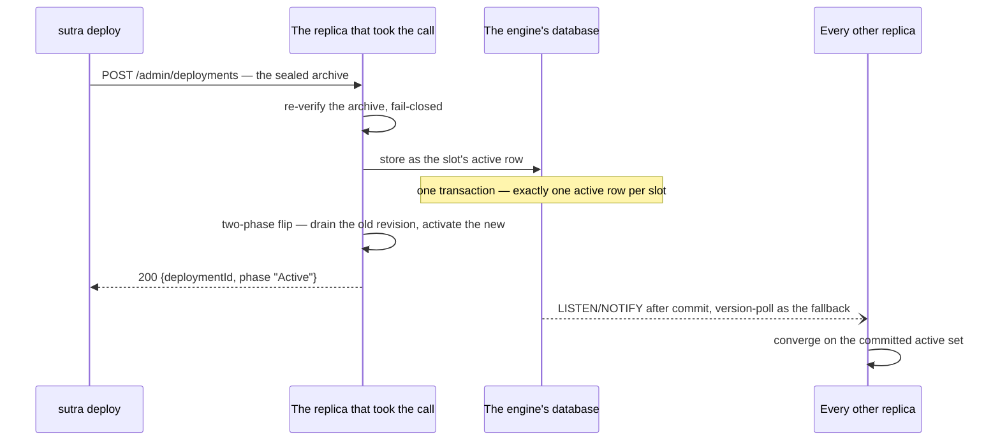
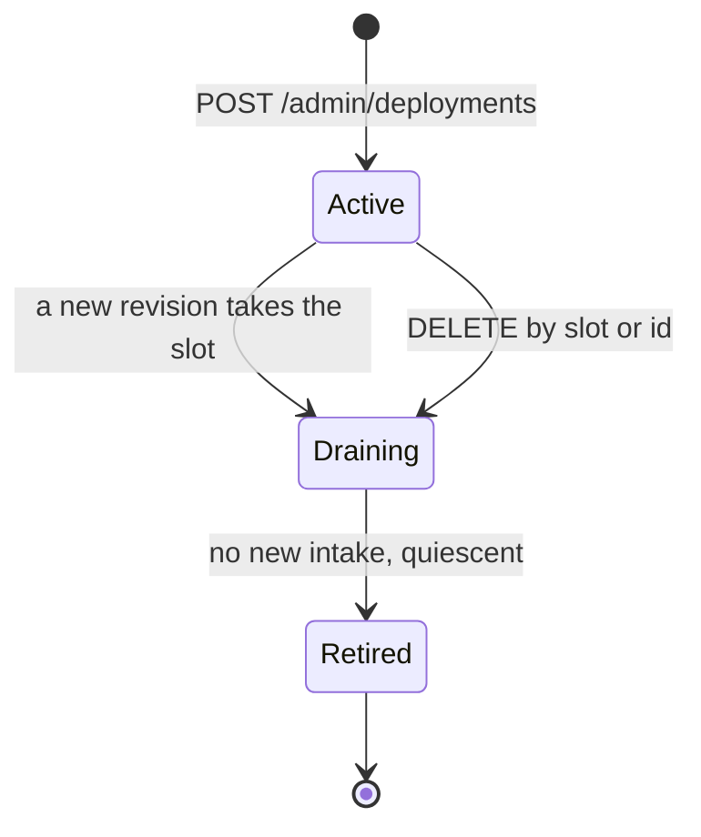
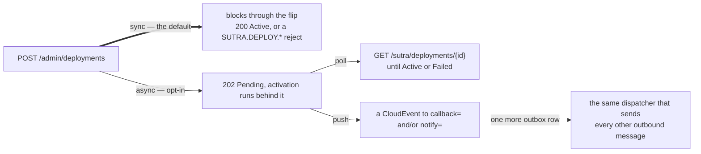

# Deployment model

A `.sutra` archive's runtime identity is a single opaque `deploymentId = sha256(manifest)` — the
manifest is derived at seal time (`sutra package`), never hand-authored. Deploying is therefore
naturally idempotent: re-deploying identical bytes is a no-op. This page is the architecture
behind [Your first deployment](../getting-started/first-deploy.md) and
[Deploy, hot-deploy, and rollback](../operating/deploy-rollback.md) — how activation actually
works underneath the CLI.

## The database is the source of truth

Sealed archives are stored in the engine's own datasource — the same core database that backs
instance state, the outbox, and the lease table — as a `deployment_archive` row keyed by a stable
**slot** (the archive's `tenant--module--version` key). Exactly one row per slot is ever `active`;
deploying a new revision to an existing slot replaces the old active row in one transaction. This
is what makes hot-deploy a **replace**, not a restart: the slot name is stable across versions,
only the content-addressed `deploymentId` changes.

Loading is symmetric — on boot, the engine loads its active set from the database (`WHERE
status='active'`), not by scanning a directory. A restarted or newly-scaled replica rehydrates its
active set from the shared database, not from whatever a local volume happens to reflect.

## Deploy is an API call

`POST /admin/deployments` is the one control path onto a running engine (auth-gated — see
[Configuration reference](../operating/configuration.md) for the admin auth scheme). It:

1. Accepts the sealed archive's bytes.
2. Re-verifies them fail-closed (the same archive-integrity check `sutra package` already ran
   client-side).
3. Stores the new revision as the slot's active row, in a transaction.
4. Runs the two-phase activation flip in-process (drain the old revision if one exists, activate
   the new one).
5. Returns synchronously: `200 {deploymentId, phase: "Active"}`, or a `4xx` carrying the
   `SUTRA.DEPLOY.*` reject diagnostic.

Because the HTTP response *is* the activation signal, there is no propagation window to reason
about, no separate "did it actually take?" step — this is the property that makes deploys
deterministic rather than eventually-consistent from the caller's point of view.

The caller's answer arrives only after the flip, so it is definitive; the rest of the fleet
converges off the committed row rather than off anything the deploying replica tells it.

`DELETE /admin/deployments/{slot|id}` marks a row `draining`; the engine's activation flip drains
it (no new intake, retire once quiescent).

The slot outlives its revisions: taking a slot moves the old row sideways into `draining` rather
than deleting it, which is what makes a hot-deploy a replace rather than a restart.

## Sync vs. async — the same call, two response shapes

For a small or local deploy, the synchronous form above is the whole story: one request, one
definitive answer. For a large deployment where the engine's own plan-and-flip work risks a
long-held request — mainly a concern behind an ingress with a short read timeout — the identical
endpoint accepts an async mode:

- **Sync (default)**: `POST /admin/deployments` blocks until the flip completes, returning
  `Active` or a reject.
- **Async (opt-in)**: the same POST returns immediately with `202 {deploymentId, status:
  "Pending"}`; activation runs in the background. The caller learns the outcome one of two ways:
  - **Poll** `GET /sutra/deployments/{id}` — short, ingress-safe requests — until it flips to
    `Active` or `Failed`.
  - **A completion event.** The caller opts in with `callback=<https-url>` (a webhook) and/or
    `notify=<broker-uri>` at deploy time; on completion the engine emits a CloudEvent
    (`com.sutra.deployment.activated` / `com.sutra.deployment.failed`) carrying
    `{deploymentId, slot, revision, status[, error]}`. This rides the engine's existing outbound
    spine — one more durable outbox entry, delivered by the same dispatcher that sends every other
    outbound message — so a deploy-complete notification is not a separate mechanism, just another
    emission.

This is a long-running-operation (LRO) shape, not a bespoke deploy protocol: accept fast, do the
work in the background, let the caller choose polling or a push notification.

## Multi-replica convergence

The replica that handled the deploy call activates locally and returns synchronously; every other
replica converges asynchronously on the committed database state — on PostgreSQL via `LISTEN`/
`NOTIFY` after the commit, with a version-poll fallback for dialects with no equivalent
(MySQL/MariaDB/SQL Server) and as the resilience backstop on Postgres itself. A single-replica run
needs no convergence step at all — the one replica that deployed is already the whole fleet.

## Next

- **[Deploy, hot-deploy, and rollback](../operating/deploy-rollback.md)** — the operator-facing
  walkthrough of the same mechanism.
- **[Replica semantics](replicas.md)** — how the rest of the engine's durable state stays correct
  across a replica set, using the same PostgreSQL-backed primitives.
