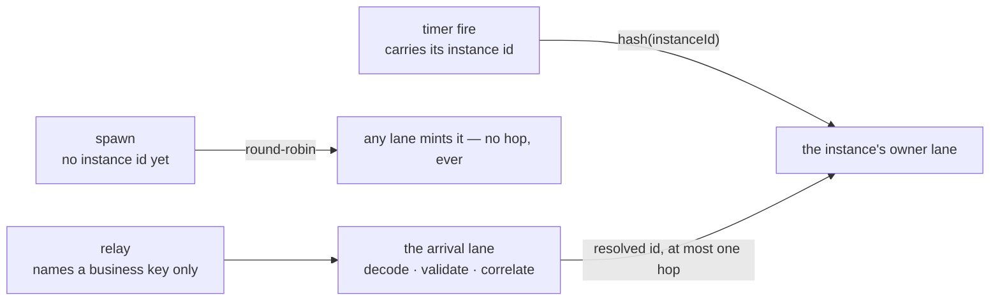
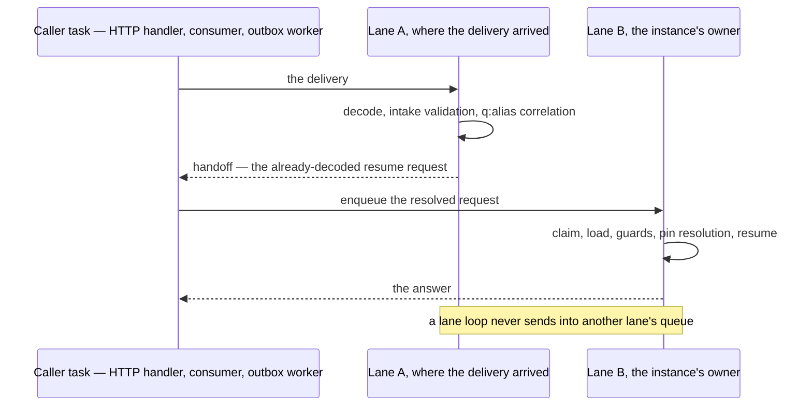
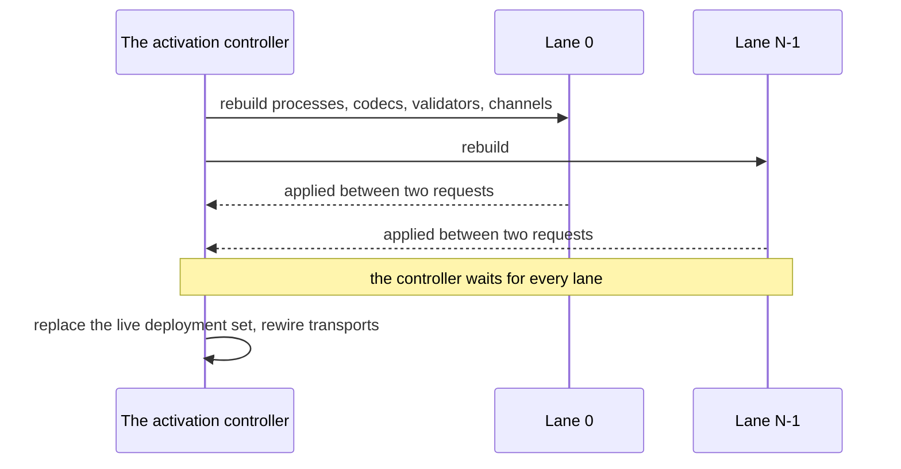

# Execution lanes

Inside one replica the engine executes on **N identical actor lanes**. Every piece of
instance-addressed work is routed onto a lane by a stable hash of the instance id, and one lane
drains one request at a time — so all work for a single instance runs in arrival order, on one
lane, with nothing else interleaved into it. That property is the contract, and it holds
identically at every `N`.

Lanes are an *in-process* scale-out story. They sit underneath — and are entirely independent of
— the horizontal one: a replica has N lanes; a deployment has M replicas; the two multiply. See
[Replica semantics](replicas.md) for the cross-replica half.

## Why lanes exist

A single serial execution lane is a convoy. One slow commit does not merely delay its own
instance — it delays every instance behind it on the same lane, however unrelated. Splitting the
lane into N lanes removes the convoy without changing what happens *within* a lane: the ordering
guarantees a single lane gave are the guarantees each of the N lanes still gives.

Nothing else about execution changes. Lanes do not partition data, do not shard the database, and
do not introduce a placement or affinity model an operator has to reason about. They are a
parallelism mechanism inside a process, nothing more.

## Routing: a stable hash of the instance id

The routing key is the **instance id**. It is the unit of durable state (one snapshot row), the
unit of mutual exclusion (one ownership claim), and the unit the guarantee names. Nothing else
works as a key: a correlation alias is not stable per instance (one instance can carry several
alias rows with different values), a deployment or a tenant is far too coarse to spread load, and
a channel splits one instance across lanes the moment its relays arrive on a channel other than
its spawn's.

Work arrives in three shapes, and the router handles each differently:

| Arrival | Routing |
|---|---|
| **The id is already known** — a timer fire carries the instance it belongs to | Straight to that instance's lane. No hop. |
| **The id does not exist yet** — a spawn from an inbound message, or a due timer start event | Any lane may mint it; arrivals are spread round-robin. No hop, ever. |
| **The id is learned mid-pipeline** — a relay | Resolved on the arrival lane, then handed off if the owner lane is a different one. |

Only a relay can hop, and only once — because the id it routes on does not exist until the arrival
lane has decoded and correlated the delivery.

### The cross-lane handoff

A relay does not name an instance id on the wire. It names a business key, and the engine only
learns the instance after channel resolution, decoding, intake validation, and evaluating the
`<q:alias>` correlation expression. All of that runs on the lane the delivery arrived on, exactly
as it always has.

When that resolution names an instance owned by a *different* lane, the arrival lane does not
execute it and does not push it into the other lane's queue. It answers its caller with a
**handoff**: the already-decoded, already-validated resume request. The caller's own task — the
HTTP handler, the broker consumer, the outbox worker — then enqueues it on the owner lane and
waits for that lane's answer. Two rules make this safe by construction:

- **Lane loops never send into another lane's queue.** Only caller-side tasks do. The mutual-block
  deadlock (lane A stuck sending into a full queue on B while B is stuck sending into A's)
  therefore cannot arise at all.
- **At most one hop.** The lane that receives the resolved request runs it where it lands. It
  re-runs only the race-sensitive part — claim, load, terminal/failed/suspended guards, deployment
  pin resolution, resume — never the decode, validation, or correlation, which are deterministic
  over the delivery and already done.

The hop travels back out through the caller rather than lane-to-lane, which is what makes the
mutual-block deadlock impossible and turns a full queue into backpressure on the transport.

Only relays ever hop. Spawns and timer fires never do.

## Claims are the correctness mechanism; routing is only affinity

This is the property worth internalizing: **routing is an optimization, not the thing that keeps
execution correct.** Correctness comes from the per-instance ownership claim described in
[Replica semantics](replicas.md#instance-ownership-claims) — and the claim's owner identity is
lane-scoped, not just process-scoped.

The consequence is that a mis-route is harmless. If work for an instance ever lands on the wrong
lane — a bug, a hash change, anything — the claim bounces it exactly as it bounces a competing
replica today: a broker relay is requeued, a timer fire is deferred and retried. A mis-route
degrades to visible, retry-safe contention. It can never degrade to two lanes interleaving inside
one instance.

That is also why the claim-bounce meter below doubles as the mis-route alarm.

## The activation flip

A deploy activation rebuilds the engine's live view of processes, codecs, validators, and
channels. Under lanes, the controller sends that rebuild to **every** lane and **waits for all of
them** before it replaces the live deployment set and rewires transports.

The await-all barrier is the only thing lanes add to the flip: the later stages cannot begin until
every lane has applied its rebuild.

Per-lane atomicity is what matters, and it is preserved: a lane applies its flip between two
requests, never inside one, so nothing is ever observed half-flipped. Because every step of an
instance runs on that instance's one lane, its flip is a single point in its own queue — no
instance can straddle two definitions. During the fan-out window two *different* instances can be
served either side of the flip, which is indistinguishable from two deliveries ordered around a
single flip point.

## Lanes never block on store I/O

Each lane is one asynchronous loop awaiting one request to completion before it dequeues the
next. Every persistence call on the execution path is awaited rather than blocked on, so a lane
waiting on the database parks on the runtime instead of holding a thread hostage — which is what
keeps tail behavior sane when lanes outnumber available pool connections.

The ordering properties are unchanged by this, deliberately: because the loop awaits each request
to completion before recv-ing the next, the commit still happens-before the reply and
happens-before the next request is dequeued. There is no intra-lane pipelining and no completion
re-entry, so there are no re-entry rules to get wrong.

## What changes at N > 1 — say it out loud

**Incidental cross-instance serialization disappears.** With one lane, two concurrent deliveries
to two *different* instances of the same flow never interleave — as a side effect of there being
one lane, not as a promise. At N > 1 they genuinely run in parallel.

This was never the contract, and every documented concurrency mechanism is unaffected:

- per-channel `singleton` / serial consumption (a transport-side property — one delivery in
  flight — which lanes do not touch);
- per-channel and per-tenant admission caps (see [Limits and quotas](../operating/limits.md));
- optimistic `expect="unchanged"` writes and pessimistic `forUpdate` locks on data stores (see
  [Data stores](../building/data-stores.md)).

But a deployment that has been silently leaning on the single-lane side effect *will* observe new
interleavings. That is precisely why the default is one lane and turning it up is an explicit
operator action.

Two other narrowings are worth naming, and both only affect a persistence-less engine (no
datasource configured — a dev/test posture): in-process alias uniqueness and in-process inbox
dedup become per-lane rather than per-process. Under any pooled production posture both are
database-backed and cross-lane safe, exactly as they are already cross-replica safe.

## What lanes do not change

Every background role stays exactly one per replica, or one per cluster by lease — none of them
becomes lane-aware beyond dispatching *into* the router:

| Role | Under lanes |
|---|---|
| Timer poller (lease-gated) | Unchanged as a role. Timer fires route by their instance id; schedule fires spread round-robin. Its per-tick fire loop gains bounded concurrency up to the lane count, so a timer burst is not capped at one lane. |
| Stuck-instance sweep, terminal-retention sweep | Unchanged. Both sweep by age and are owner-blind. |
| Outbox worker | Unchanged. Its in-process delivery sink re-enters through the router like any transport. |
| Deployment watcher and quiescence sweep | Unchanged as roles; the activation flip is the fan-out above. |
| Deferred-ack registry and its timeout sweep | Unchanged — one per replica, shared across lanes and across activation flips. |
| Per-channel `singleton` consumers | Unchanged. Their serialization is transport-side (one delivery in flight), so it survives lanes intact. |

## Configuring and observing lanes

`sutra.engine.shards` sets the lane count (default `1`); `sutra.engine.shard-queue-capacity`
optionally bounds each lane's mailbox, in which case a full queue makes the *caller* wait, so
backpressure propagates outward to the transport — never sideways into another lane. Full key
detail: [Configuration reference](../operating/configuration.md#execution-lanes).

Meters shipped with the feature, all carrying the lane index as a dimension:

| Meter | What it tells you |
|---|---|
| `sutra.engine.shard.queue-depth` | Per-lane backlog. Sustained skew across lanes means a hot instance or a hot arrival burst, not an undersized fleet. |
| `sutra.engine.shard.dispatches` / `.parks` / `.resumes` | Per-lane work rates. |
| `sutra.engine.shard.handoffs` | Cross-lane relay hops. Expected and healthy — it rises with lane count by construction. |
| `sutra.engine.shard.claim-bounces` (split `relay` / `timer`) | The mis-route alarm. On a correct rollout it should read near zero outside genuine cross-replica contention. |

The **live** lane count is readable without reading configuration: `GET /sutra/health/ready`
reports it in the loader check's `data.shards`, read off the running router rather than echoed
back from config — which is what lets a smoke test assert that a container actually came up with
the lane count you meant.

Lane **death** is a health condition, not just a log line. A lane can only die outside the
per-dispatch panic containment (a failure in the lane's own build), and after that every piece
of work hashed to it would answer `SUTRA.RUNTIME.UNEXPECTED` forever while the process
otherwise looks healthy. Both probes therefore watch for it: `GET /sutra/health/live` returns
`503` with the dead lane indexes in `data.deadLanes` — the signal an orchestrator should
*restart* on, because a dead lane's key space has no other home inside the process — and
`GET /sutra/health/ready` goes `DOWN` at the same moment so no new traffic routes to the
replica while the restart is pending.

## Next

- **[Replica semantics](replicas.md)** — ownership claims, leader-gated singletons, and the
  cross-replica half of the same picture.
- **[Configuration reference](../operating/configuration.md#execution-lanes)** — the two keys.
- **[Lanes: the design reasoning](../internals/execution-lanes-design.md)** — why the ordering
  properties survive, what the serialization audit found, and the runtime shape that had to be
  falsified first.
