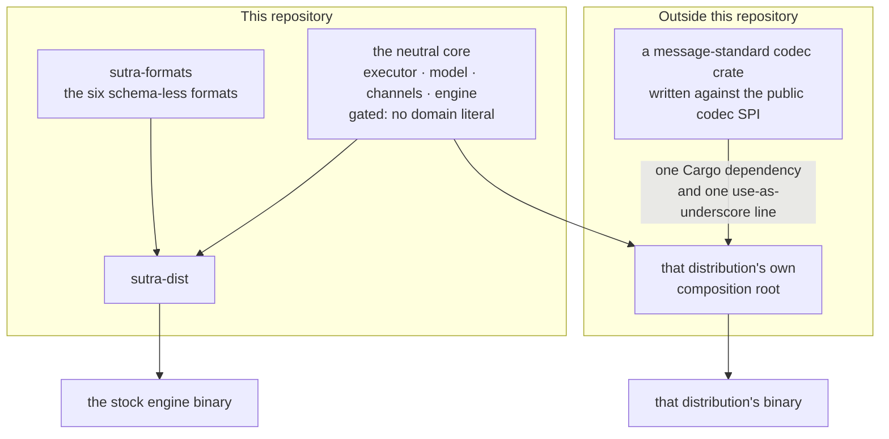
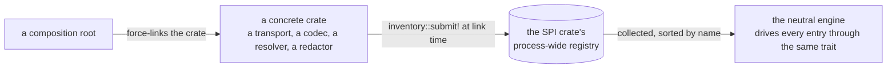

# Domain neutrality and the SPI model

**The engine core never names a business domain, a vendor, or a wire format.** Not SWIFT, not
FedNow, not ISO 20022, not Kafka, not PostgreSQL-as-a-brand. Payments, health, and EDI live
entirely in codecs, transports, validators, and deployment packages — never in the token
executor, the BPMN model, or the channel dispatcher. This is the single rule everything in this
chapter exists to serve, and it is not a style guideline: it is checked by a build gate on every
change.

## Why this is load-bearing

A domain-neutral core is what lets one engine binary serve payments today and healthcare tomorrow
without a fork, what lets a hardened build strip out everything it doesn't need down to the byte,
and what keeps the surface a security review has to reason about small and stable. The moment a
business term leaks into the executor or the model, that guarantee is gone for everyone, silently.

## The gate: `sutra-archtest`

`rust/crates/sutra-archtest` is the Rust twin of what used to be an ArchUnit test on the retired
reference baseline. It walks a fixed set of crates' `src/` trees, strips comments (a domain term
cited in a doc comment is fine — only a term baked into an identifier or a string literal is a
violation), and fails the build on any hit against a denylist:

```rust
pub const DOMAIN_DENYLIST: &[&str] = &[
    "swift", "fednow", "fedwire", "pacs", "camt", "nacha", "edifact", "hl7", "iso20022", "x12",
];
```

**Enforced — must be domain-literal-free:**

- The neutral core: `sutra-executor`, `sutra-bpmn`, `sutra-feel`, `sutra-dmn`, `sutra-srl`,
  `sutra-templates`, `sutra-persistence`, `sutra-datastore`, and the codec/format/schema SPI
  itself (`sutra-codec-spi`).
- The assembly/binding layer: `sutra-channels` (protocol-neutral channel binding) and
  `sutra-engine` (the library) — domain-literal-free since the transport and codec extraction and
  the `sutra-dist` composition-root split.

**Deliberately excluded — the legitimate domain edge, by design:**

- `sutra-dist` — the composition root. It force-links the built-in formats, the redactors, the
  vendor secret-resolvers, and the feature-selected transports, so it necessarily *names* them.
  That's the one place wiring concretes to SPIs is supposed to happen — not a core leak.
- The concrete implementations themselves: `sutra-formats`, `sutra-codec-schema`, every
  `sutra-transport-<vendor>` crate, and `sutra-redactor-pci`.
- Tooling and test crates (`sutra-cli`, `sutra-conformance`, `sutra-testkit`, the generators).

Read that exclusion list again for what *isn't* on it. **This repository contains no
message-standard codec at all.** The built-in codec set is the six schema-less formats in
`sutra-formats` — `json`, `xml`, `yaml`, `csv`, `raw-text`, `raw-bytes` — and `sutra-dist`
force-links nothing else that registers one. Every wire standard — SWIFT MT, SWIFT MX, rail
variants such as FedNow, and the EDI/segment families (HL7 v2, X12, NACHA/ACH, EDIFACT) — is a
**proprietary extension crate maintained outside this repository**, consuming exactly the public
SPIs a third party consumes.

That is the strongest available evidence that the SPI boundary is real rather than aspirational:
adding a message standard to a distribution costs one Cargo dependency and one `use <crate> as _;`
line in that distribution's own composition root. Nothing in `sutra-engine`, `sutra-channels`, or
this repository's composition root changes, and there is no central list anywhere to add a name
to. The gate has nothing to exclude for those crates because they are not here; the neutral core
cannot leak a term that never enters its dependency graph.



A distribution adds a wire standard by force-linking one more crate into its *own* composition
root — there is no central list in this repository to append a name to, which is what makes the
neutrality gate cheap to keep passing.

`make lint` runs this gate alongside clippy on every change (see
[Contributing](../contributing.md)) — a business term landing in a gated crate fails CI, not a
code review comment.

## The mechanism: self-registration behind a neutral SPI

Every extension point follows the same shape: a small SPI crate defines a trait and a
process-wide registry; each concrete implementation is its own crate that **self-registers** into
that registry via [`inventory`](https://docs.rs/inventory) at link time. The neutral crate
*collects* what got linked in — it never imports or names a specific implementation. Implementing
an extension *is* registering it; there is no separate central list to forget to update (a gap
that bit an earlier iteration of the codec set, closed by moving to this pattern).



The neutral side only ever iterates what got linked in, so adding an implementation is a link-time
fact rather than an edit to anything the engine owns.

### Transports — `sutra-transport-spi`

```rust
pub struct TransportFactory {
    pub transport: &'static str,          // the `transport:` value in channels.yaml this wires
    pub spawn: TransportSpawn,             // (defs, engine, pool, envref-resolver, runtime) -> Arc<dyn TransportChannels>
    pub register_sink: fn(&mut SinkRegistry),
    pub handles_on_complete: bool,         // self-declared capability — see below
}
inventory::collect!(TransportFactory);
```

Each `sutra-transport-<vendor>` crate submits one `TransportFactory`. The engine assembly iterates
`transport_factories()` (sorted by name for determinism) and drives every one of them through the
identical `TransportChannels` lifecycle trait (`rewire` on an activation flip, `drain` on
shutdown) — there is no `if transport == "kafka"` anywhere in the engine.

**Capability self-declaration, not a hardcoded transport check.** `handles_on_complete` is how a
transport tells the engine whether it can realize `ack-mode: on-complete` (a broker deferring its
settle through the engine's ack registry, or an on-listener transport like HTTP holding the
connection to completion). When a channel declares `on-complete` on a transport whose factory
reports `false`, the engine assembly emits `SUTRA.ACK.ON_COMPLETE_UNSUPPORTED` and runs
`on-persist` instead — a loud, generic degrade driven by a flag the transport itself set, not a
list of vendor names the engine maintains. See
[Acknowledgement modes](../operating/ack-modes.md) for the full per-transport wiring table this
flag produces.

### Codecs — `sutra-codec-spi`

```rust
pub trait PayloadCodec {
    fn name(&self) -> &str;
    fn accepted_content_types(&self) -> Vec<String>;
    fn decode(&self, body: &[u8], content_type: Option<&str>) -> DecodeResult;   // never panics
    fn declared_message_types(&self) -> Vec<String> { Vec::new() }
    fn shape_of(&self, message_type: Option<&str>) -> Option<SchemaShape> { None }
    // + encode (the reply direction)
}
```

A zero-config, globally-named codec — each built-in format (`json`, `xml`, `yaml`, `csv`,
`raw-text`, `raw-bytes`), and any extension crate that wants a global name — submits a
`BuiltinCodec { name, make }`; `builtin_codecs()` collects and sorts them, and each is addressable
as `urn:sutra:codec:<name>` with no per-package configuration. A schema-backed *user* codec
(compiled from a package's own `schemas/<name>/*.xsd`) does **not** self-register this way — it's
instantiated per package, per the path-derived URN rule in
[Deployment packages](../building/deployment-packages.md). Either way, the engine only ever calls
through the `PayloadCodec` trait; it has no branch for "this is the such-and-such standard
one," and no way to acquire one — the type it would have to name is not in its dependency
graph.

#### Bundle codec kinds — a codec crate registers its own schema-folder shape {#bundle-codec-kinds}

The newest extension point in this family follows the identical inventory-pull shape, one level
into how a *package's own* schema folder is interpreted. `schemaKind: xsd` and `schemaKind:
json-schema` are generic — a folder of schema files the engine validates against — but some
standards are a whole profile: an envelope grammar, a mapping from wire-level message names to
schema files, versioned editions revved on the standard's own release cadence. A codec crate that
needs that shape submits a `BundleCodecKind { kind, build }` in `sutra-codec-schema::bundle` next
to its `PayloadCodec` impl — implementing the kind *is* registering it, exactly like a
`BuiltinCodec`, and `sutra-codec-schema` itself stays free of any knowledge of which standards use
it. A package's `schemas/<name>/codec-manifest.yaml` declaring `schemaKind: <kind>` is what selects
a registered bundle over the generic ones; an unserved kind is a fail-closed deploy error naming
the kinds the running build actually serves.

A market-infrastructure rail codec — an extension crate outside this repository — is the first
user of this extension point (see [Channels and transports](../building/channels.md) and
[Deployment packages](../building/deployment-packages.md#schema-bundles-when-a-codec-is-a-whole-profile)
for the manifest shape and deployment-scoped registration it produces). It's also a useful case
study for the SPI pattern more broadly: everything specific to one rail's profile — its envelope
root names and namespaces, its per-direction wrapper tables, its quirks (a wrapper shipped without
the profile's usual name prefix, several wrappers backed by one underlying message) — is a single
data value the codec's internal walker/validator/projection code reads generically. A second rail
that follows the same envelope-and-wrapper-editions pattern would supply its own profile value and
reuse that machinery rather than re-implement it — the same "data, not a branch" discipline the
rest of this chapter describes, one layer further in.

### Data stores — `sutra-datastore`

The `DataStore` SPI is the same shape one level down: a provider (`sql` today; see
[Data stores](../building/data-stores.md)) resolves its **own** connection from `datastores.yaml`
— never the engine's internal datasource — and exposes get/put/`get_for_update`/
`put_if_revision` against `(store_name, store_key)`. The engine's executor calls through this
trait for every `<q:store>`-bound data association; it has no idea whether the value on the other
side is an account balance or a customer record.

### Secrets — `sutra-envref-spi`

The vendor-neutral seam behind `env:`, `secret:`, `${…}` placeholders, and vendor schemes like
`vault:…` / `aws-secrets:…`. A vendor resolver crate (`sutra-envref-vault`, `sutra-envref-aws`, …)
submits an `EnvRefResolverEntry`; the engine resolves a whole reference generically and names no
vendor SDK. This is what lets `channels.yaml` and `datastores.yaml` carry credentials as
references, never literals — see [Configuration reference](../operating/configuration.md).

### Redactors — `sutra-redactor-spi`

A `sutra-redactor-<standard>` crate submits a `RedactorEntry` that *locates* sensitive spans in a
decoded payload (a JSON-Pointer-shaped path + a reason code); the engine masks every located path
on every observability surface and marks it for encryption at rest. Fail-closed by construction: a
redactor that panics or errors tells the engine to **over-mask** the whole bound payload rather
than risk a leak — the opposite failure mode from a validator crash, which becomes an ordinary
business-reject issue instead.

### Validators

`<q:simpleValidator ref="…">` names a field-content validator (`iso-3166-country`,
`iso-4217-currency`, `iso-9362-bic`, …) out of a neutral registry the core knows nothing about
(see [The q: namespace](../building/q-namespace.md)). The concrete validators are domain content
and live in extension crates, outside this repository, for the same reason the domain codecs do —
which is why the neutrality gate has nothing to exclude here.

### The lifecycle bus — `ExecutionListener`

One more neutral seam worth knowing about even though it isn't a "plug in a new vendor" SPI: every
cross-cutting concern that needs to react to instance/token/task lifecycle events — audit, OTel
metrics, the deferred-ack registry — implements the same `ExecutionListener` trait and is fanned
out from a plain `Vec<Rc<dyn ExecutionListener>>` the executor calls on `on_instance_started` /
`on_instance_completed` / `on_instance_suspended` / etc. There's no dependency-injection
container; listener registration happens explicitly at executor-construction time in the engine
assembly. See [Acknowledgement modes](../operating/ack-modes.md) for `DeferredAckRegistry` as a
concrete example, and [Observability](observability.md) for the OTel listener.

## Where business content actually lives

Given all of the above, a real deployment's domain-specific content lives in exactly two places:

1. **Inside a deployment package** — the BPMN processes, DMN/`.srl` rules, `channels.yaml`,
   `datastores.yaml`, and the package's own XSD-backed codec (see
   [Deployment packages](../building/deployment-packages.md)). This is where almost all business
   logic belongs, and it needs zero Rust code.
2. **In an extension crate**, only when the domain needs a *new kind* of codec, transport,
   validator, or redactor that doesn't already exist — implemented against the relevant SPI above
   and linked in by a composition root (`sutra-dist`, or your own if you build a custom binary).

## Worked example: adding a transport

Say you need a new broker Sutra doesn't ship a transport for. The shape is fixed by the pattern
above:

1. Create `sutra-transport-<vendor>`, depending on `sutra-transport-spi` and `sutra-channels`.
2. Implement `TransportChannels` (`transport()`, `consumer_count()`, `rewire(active)`, `drain()`,
   `stop_all_detached()`, and the one optional capability `inbound_router()` — only HTTP-shaped
   transports return `Some`).
3. Implement the inbound spawn function with the uniform signature
   `(&[ChannelDefinition], EngineHandle, Option<PgPool>, EnvRefResolver, tokio::runtime::Handle)
   -> Result<Arc<dyn TransportChannels>, Diagnostic>`, and an outbound sink registrar
   `fn(&mut SinkRegistry)`.
4. Decide whether your transport can realize `ack-mode: on-complete` (deferred settle, or holding
   the connection) and set `handles_on_complete` honestly — get this wrong and channels either
   silently under-deliver on a promise, or trigger the loud unsupported diagnostic needlessly.
5. `inventory::submit! { TransportFactory { transport: "your-broker", spawn, register_sink,
   handles_on_complete } }` next to your implementation.
6. Add your crate as an optional dependency behind a same-named Cargo feature in whatever
   composition root force-links it (`sutra-dist`, or a custom one) — nothing in `sutra-engine` or
   `sutra-channels` changes.

A new codec follows the identical shape against `PayloadCodec` instead, submitting a
`BuiltinCodec` for a zero-config global codec, or shipping as a package-local schema-backed codec
with no self-registration at all. Every message-standard codec in existence takes that first
path — including the ones a downstream distribution ships — so it is a well-travelled route, not
a theoretical extension point kept alive by a single in-tree user.

## Next

- **[Deployment model](deployment-model.md)** — how a package's declared channels/codecs/stores
  get resolved against whatever is linked into the running binary.
- **[Contributing](../contributing.md)** — the repo map, including where each SPI crate and its
  concrete implementations live.
