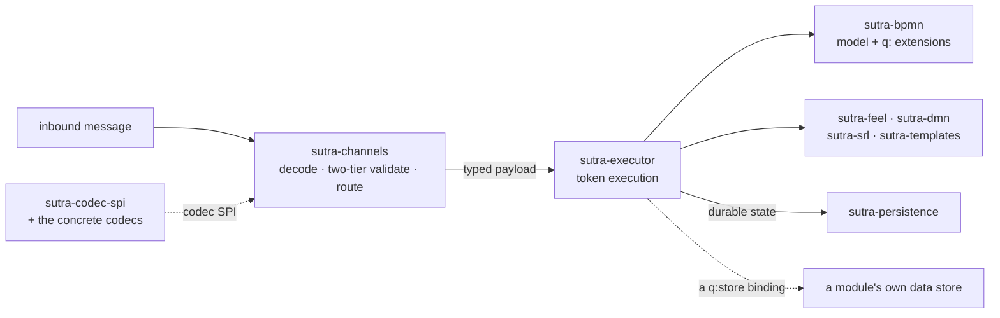
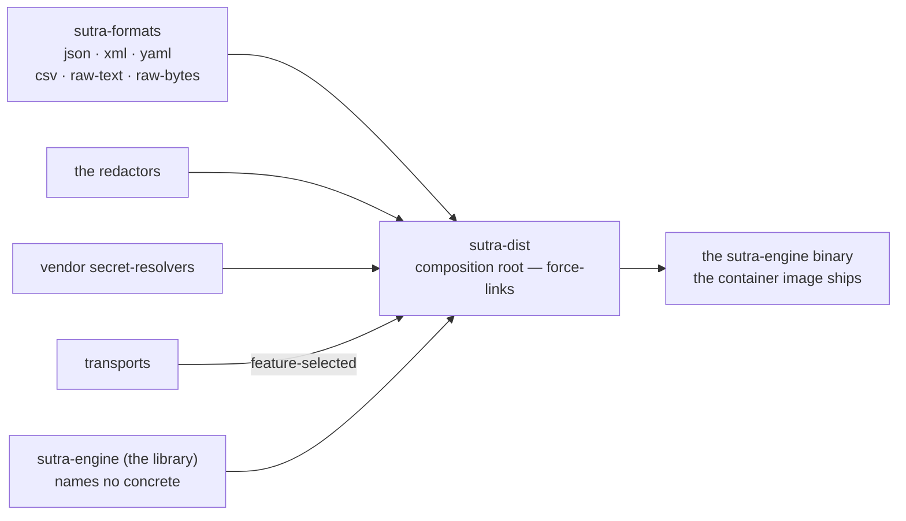

# Engine layering

Sutra is a single Cargo workspace under `rust/`. The crates split cleanly along the layers a
message passes through, plus one composition root that assembles them into the thing you actually
run.

## The layers

```
sutra-dist            composition root — force-links concrete codecs/transports/resolvers,
                       produces the `sutra-engine` binary (see Dockerfile)
   │
sutra-engine           the engine LIBRARY — config, deploy/activation, admin API, OTel,
                       audit sinks, the outbox tick loop. Domain-neutral: it collects
                       codecs/transports/resolvers generically via their SPIs and names none.
   │
sutra-channels         protocol-neutral channel binding + dispatch: decode → two-tier
                       validate → route to a start event or a parked wait → execute
   │
sutra-executor         the token executor: gateways, sub-processes, data associations,
                       compensation, path-coverage tracking — synchronous and stateful paths
   │
sutra-bpmn             the BPMN 2.0 + q: extension model and loader
   │
sutra-feel / sutra-dmn / sutra-srl / sutra-templates
                       the expression + decision + template languages every task type runs on
   │
sutra-persistence      durable state: instances, outbox, inbox dedup, lease, audit — PostgreSQL
                       (MySQL/MariaDB/SQL Server dialects follow the same pattern)
```

A message arrives on a channel (`sutra-channels`), gets decoded and validated by a codec
(`sutra-codec-spi` + the concrete codec crates), is routed to a process, and the process runs on
the token executor (`sutra-executor`) over the BPMN model (`sutra-bpmn`), evaluating FEEL/DMN/`.srl`
expressions (`sutra-feel`, `sutra-dmn`, `sutra-srl`) and rendering templates (`sutra-templates`)
along the way. Anything durable — the instance snapshot, the outbox, the inbox dedup row, a data
store write — goes through `sutra-persistence` (or a module's own store, for data stores; see
[Data stores](../building/data-stores.md)).



Decode-and-validate happens once, at the doorway; everything below the channel layer only ever
sees a typed payload, and every durable write leaves through one crate.

## The composition root

`sutra-engine` — the library — never names a concrete codec, transport, or secret-resolver
implementation. `sutra-dist` is the one crate allowed to: it force-links the schema-less formats
(`json`, `xml`, `yaml`, `csv`, `raw-text`, `raw-bytes`), the redactors, the vendor
secret-resolvers, and the feature-selected transports, and produces the `sutra-engine` binary the
container image ships (`docker build -f rust/Dockerfile rust/`). It force-links no domain codec:
every message standard is a **proprietary extension crate** built outside this repository,
registering through the same SPIs and force-linked by its own composition root, which is
precisely what this split is for. This split is what lets a hardened build drop everything it
doesn't need — `cargo build -p sutra-engine --no-default-features --features file` links no broker
client at all — without touching a line of the neutral engine or channel code.



Every concrete implementation enters the binary at exactly one crate — which is what lets a
hardened build link no broker client at all while the neutral crates it depends on stay untouched.

See [Domain neutrality and the SPI model](neutrality-and-spi.md) for exactly how that boundary is
drawn and mechanically enforced, and what a third party has to write to add a new transport or
codec.

## Where the tooling sits

`sutra-cli` (the `sutra` binary) depends on the model/loader layer read-only for its inspection
commands (`describe`, `dispatch-graph`, `simulate`, `explain`), and on `sutra-persistence` +
`sutra-channels` for the commands that touch a running engine or a database behind it (`deploy` and
`migrate` against the engine's own; `coverage check --archive` against the one a deployment's
`coverage` store declares). It is not part of the engine's own runtime dependency
graph — a deployed engine binary has no CLI code linked into it.

## Next

- **[Domain neutrality and the SPI model](neutrality-and-spi.md)**
- **[Deployment model](deployment-model.md)** — how a package activates against this layering.
