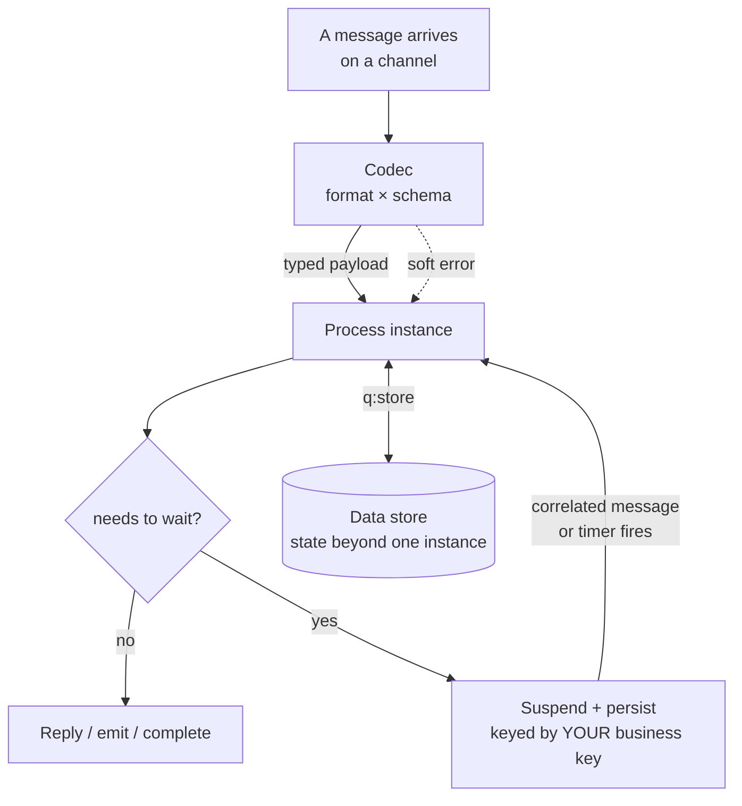

# Concepts overview

Sutra is organized around a few load-bearing ideas. This page is the map; deeper chapters will
expand each one.

Everything below is one of these boxes examined closely.

## The message is the contract

A start event binds to a **channel** and a **message type**. The engine decodes the real wire
format and validates it against a schema *before* the process runs, so malformed input becomes a
**routable soft error**, not an exception deep in the flow.

## Codec = format × schema

A **codec** pairs a **format** (how bytes are structured) with a **schema** (what a valid message
looks like). Decoding and validation are one step. One schema can declare several message types,
and dispatch fans out one process per type. Six formats are built in — JSON, XML, YAML, CSV, raw
text, raw bytes; a schema-bound codec comes either from the package itself (XSDs under
`schemas/<name>/`, compiled at deploy time) or from an extension crate implementing the codec
SPI, which is how a message standard (an industry wire format with its own envelope grammar and
schema editions) is served.

## Channels and transports

Processes are triggered by **messages arriving on channels** — HTTP, five brokers (Kafka,
RabbitMQ, AWS SQS, Google Pub/Sub, AMQP 1.0), and an air-gapped file transport. `<q:source>`
binds a start event to a channel + message type. Co-deployed processes hand off over an
in-process `local://` channel.

## Wait-states and correlation

Wait states (`userTask`, intermediate message catch) **suspend → persist → rehydrate → resume**.
A later message is correlated back to the parked instance by a **business key you name**
(`<q:alias>` — e.g. an `EndToEndId` or an order reference), not an engine id, and it's durable and
replica-coherent on PostgreSQL.

## Durable state beyond one instance

Wait-state data belongs to *one* instance. State that outlives an instance, or is shared between
them, lives in a **[data store](data-stores.md)** — declared in the package (`datastores.yaml`),
read and written from the flow through `<q:store>`, and transactional, with optimistic
concurrency (`expect="unchanged"`) and pessimistic locking (`forUpdate="true"`) where a
read-modify-write needs them. Each store owns **its own connection**: the engine's database is
never the module's. A store is key/value by default and holds a value of any shape; a *flat*
record may additionally declare its `structure:` and project onto real typed columns in a table
you own, so the SQL tooling you already point at that database reads it directly.

## Rules — DMN, `.srl`, and FEEL

A `businessRuleTask` binds a `.dmn` decision table **or** a `.srl` ruleset (a Drools-inspired
`rule / when / then` DSL). Both compile onto one shared **FEEL** evaluator — no JVM, no Rete
runtime.

## The `q:` vocabulary

Layered BPMN extensions keep diagrams standard while removing boilerplate: `<q:dispatch>` /
`<q:case>` (a routing table instead of gateway sprawl), `<q:validators>`, `<q:alias>`,
`<q:reply>`, `<q:variables>`, `<q:audit>`, and `<q:coverage>`.

## Content-addressed deployment

The deploy unit is one sealed **`.sutra`** archive; runtime identity is a single opaque
`deploymentId = sha256(manifest)`. Deploys are idempotent, hot-reload flips activation without a
restart, and **secrets never live in the archive** — channels reference them by scheme
(`secret:` / `env:` / `vault:` / `aws-secrets:` / …), resolved at runtime through one
vendor-neutral SPI.

## Multi-tenancy and observability

Per-channel tenant binding, single-database PostgreSQL with **per-deployment row-level
security** across PG / MySQL / MariaDB / MSSQL, OTLP traces / metrics / logs to any collector,
plus KEDA autoscaling and leader election.
