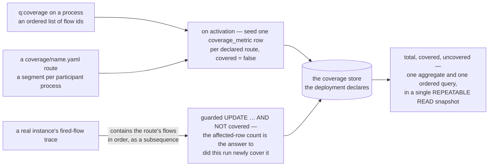
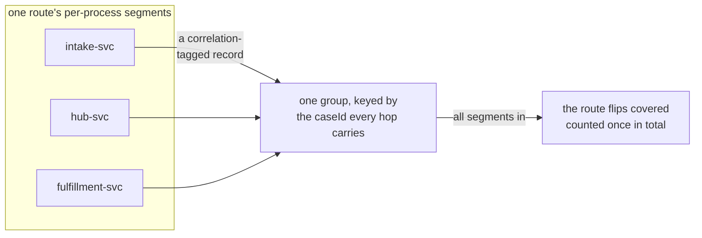

# Coverage: declared routes as the compliance signal

Compliance in a Sutra deployment isn't reconstructed from logs after the fact. A module owner
**declares the business-event routes that matter** — "the happy-path completion," "the reject
branch," "the end-to-end route across all three collaborating processes" — and the engine ticks
each one off as real instances walk it. That declaration is the whole compliance surface: a route
nobody declared can never show up as covered *or* uncovered, so what you choose to declare is
exactly what you can ever detect. This chapter covers the two shapes a route can take, how to
declare each, the CLI that drives them, and — the part that actually determines whether the
feature is useful — how to curate the declared set down to what's worth watching.

## What "covered" means

A route is an ordered path through execution: for an **intra-process** route, an ordered list of
one process's own sequence-flow ids; for a **cross-process** route, a per-process segment of flows
for each participant in a correlated cascade, tied together by a business key that threads every
hop. A route is marked **covered** the moment an instance (or, cross-process, a correlated group of
instances) walks every one of its flows in order; it stays **uncovered** since the last reset
otherwise. There is no partial credit and no percentage for anything you didn't declare — `total`
is exactly the number of declared routes, `covered` is how many have flipped, and the uncovered
list is the rest.

Both shapes land in **one** place: the `coverage` data store the deployment declares in its own
`datastores.yaml`, as a typed `coverage_metric` row per declared route carrying a `covered` boolean
— entirely separate from the audit trail, so coverage never reads audit tables and audit never reads
coverage's. That's also what makes coverage cheap to skip: a process with no declared route pays
nothing (no flow-trace capture, no writes). See
[Where coverage is stored](#where-coverage-is-stored) for the division of labour that store implies:
you pick the database, the engine owns the schema.

| Shape | Declared | Spans |
|---|---|---|
| Intra-process | `<q:coverage path="…" flows="…"/>` inline on a `<bpmn:process>` | one process |
| Cross-process | a `coverage/<name>.yaml` file, URN-identified `urn:sutra:coverage:<name>` | several correlated processes of one deployment |



Declaration is what creates the measurable surface: `total` is exactly the seeded set, so a route
nobody declared can never appear as covered *or* uncovered, and the percentage is derived on read
rather than kept as a counter that could drift.

## Intra-process: `<q:coverage>` inline

The simplest case declares a route directly on the process it belongs to, as an ordered list of
sequence-flow ids — the same ids the diagram already shows on every arrow:

```xml
<bpmn:process id="transfer">
  <bpmn:extensionElements>
    <q:coverage path="accept" flows="Flow_TxToOk Flow_OkToEnd"/>
    <q:coverage path="reject" flows="Flow_CancelToReject Flow_RejectToEnd"/>
  </bpmn:extensionElements>
  …
</bpmn:process>
```

A run covers a path when its fired-flow trace contains `flows` as an **ordered subsequence** — so
whatever intake channel started the instance (money-transfer's `transfer.bpmn` has three) is
irrelevant to whether `accept` or `reject` gets marked, and a wait-state park in the middle doesn't
break the match. See [Worked example: money-transfer](worked-example.md#compliance-path-coverage)
for this declaration driving a real ACID transfer flow end to end.

Fail-closed checks at load: a flow id the process doesn't have, a set of flows that isn't a
contiguous route (each flow's target must be the next flow's source), or a reused `path` id inside
one process all evict the module rather than silently declare something meaningless. A process that
declares at least one `<q:coverage>` must also declare a `coverage` store in `datastores.yaml`
(`SUTRA.CONFIG.COVERAGE.STORE_MISSING` at lint time) — that store is *where the marks are
persisted*, so declaring routes without it is declaring something with nowhere to record it. The
scaffold satisfies the rule for you; [Where coverage is stored](#where-coverage-is-stored) is what
the declaration actually buys.

## Cross-process: a coverage file

A route that spans more than one participant process can't live inside a single `<bpmn:process>` —
there's no BPMN element for "the flow that starts here and finishes three hops away in a different
process." Instead it's declared in a **coverage file** under the package's `coverage/` folder,
identified the same way a template is: path-derived, `urn:sutra:coverage:<folder…>:<file>`. A file
holds one or more **correlations** — the business key that ties instances of the cascade together,
and the **links** (hops) between them — plus one or more **routes** (`coverages:`) that each state
a complete set of per-process segments.

The shape that motivates this is a **relay cascade**: three collaborating services — an intake
service, a routing hub, and a fulfillment service — each its own `<bpmn:process>`, handing off over
channels rather than calling each other directly. No single process sees the whole exchange, so
"did the end-to-end handshake complete, and which way did it end" is exactly the question none of
them can answer alone. A `coverage/e2e.yaml` (`urn:sutra:coverage:e2e`) declares the routes that
span all three:

```yaml
correlations:
  - id: relay-case
    key: caseId                            # default hop key — every leg correlates on the same case id
    links:                                 # the <q:send> -> <q:source>/imec hops between the 3 processes
      # forward: intake -> hub (spawns the hub)
      - { from: intake-svc:Task_ForwardToHub,        to: hub-svc:Start_Received }
      # forward: hub -> fulfillment (spawns fulfillment)
      - { from: hub-svc:Task_ForwardToFulfillment,   to: fulfillment-svc:Start_Posting }
      # reply: fulfillment -> hub (resumes the hub's imec) - accept and reject both land here
      - { from: fulfillment-svc:Task_ReplyAccept,    to: hub-svc:Imec_AwaitFulfillment }
      - { from: fulfillment-svc:Task_ReplyReject,    to: hub-svc:Imec_AwaitFulfillment }
      # reply: hub -> intake (resumes the intake's imec)
      - { from: hub-svc:Task_ReplyToIntake,          to: intake-svc:Imec_AwaitReply }
    coverages:
      - path: e2e-accepted                 # the accepted branch
        segments:
          intake-svc:      [Flow_p1_start, Flow_p1_await, Flow_p1_done]
          hub-svc:         [Flow_p2_start, Flow_p2_await, Flow_p2_reply, Flow_p2_done]
          fulfillment-svc: [Flow_p3_start, Flow_p3_accept, Flow_p3_accept_end]
      - path: e2e-rejected                 # the rejected branch — same p1/p2, different p3
        segments:
          intake-svc:      [Flow_p1_start, Flow_p1_await, Flow_p1_done]
          hub-svc:         [Flow_p2_start, Flow_p2_await, Flow_p2_reply, Flow_p2_done]
          fulfillment-svc: [Flow_p3_start, Flow_p3_reject, Flow_p3_reject_end]
```

A few things about this shape:

- **`links` are structural, not payload access.** Each hop names a `<q:send>` node on one side and
  either a start-event `<q:source>` (a *spawn* — the hop starts a new instance) or an `imec`
  relay-wait `<q:source>` (a *relay* — the hop resumes a parked instance) on the other, matched
  against the actual channel wiring. `sutra lint` validates every link resolves against real
  channel bindings, that every `segments` flow id is contiguous within its own process, and that
  the correlation `key` resolves at both ends of every hop — a broken link or an unresolvable key
  evicts the module rather than deploying a route that can never complete.
- **The correlation key is how the runtime reconstructs the cascade**, since three separately
  dispatched instances have no shared instance id. Here it's a single value — a case id — carried
  as an author-declared header rather than a payload field: every `<q:send>` sets it
  (`<q:header name="caseId" value="caseId"/>`) and every consuming `<q:source>` reads it back
  (`<q:alias name="caseId" expression="header.caseId"/>`). A hop can override the correlation's
  default `key` when its own leg correlates on a different value — this cascade doesn't need to,
  since one case id threads every hop end to end.
- **Each route is fully self-contained.** `e2e-accepted` and `e2e-rejected` repeat their identical
  `intake-svc` and `hub-svc` segments rather than one inheriting from the other — there is no
  route-to-route inheritance, by design, so reading any one route never requires cross-referencing
  another.
- **A route can be declared but structurally rare.** `e2e-rejected` is only reachable when the
  fulfillment process takes its reject branch — under normal traffic that rarely happens, so
  `e2e-rejected` can sit uncovered indefinitely. That's not a bug in the declaration; it's the
  compliance signal doing its job: "the reject path exists and we watch for it," distinct from "the
  reject path fired." It also makes a clean assertion for a test campaign: drive one ordinary case,
  expect `e2e-accepted` to reconstruct as covered and `e2e-rejected` not to, then `reset` and
  confirm both go back to uncovered.

At load, each route's per-process `segments` are injected as ordinary intra-process coverage paths
on their own process (so the existing per-process marking is unchanged); on completion each
segment writes a correlation-tagged record, and a route flips covered once every one of its
segments has landed in the same correlated group. Reading `total`/`covered`/percentage for a
cross-process route is the same store query as an intra-process one — the mechanism composes
rather than duplicating.



Three separately dispatched instances share no instance id, so the correlation key is the whole
reconstruction; the segments are marking cursors, which is why many of them collapse onto the one
route flag a report reads.

## Composing several definitions in one package

Nothing limits a package to one kind of declaration. A deployment can carry `<q:coverage>` on
several of its own processes *and* one or more `coverage/*.yaml` files, each with its own
correlation and its own set of routes — money-transfer's inline `accept`/`reject` pair and the
file-based `e2e-accepted`/`e2e-rejected` pair above are the two shapes, and a single package is
free to declare both kinds side by side: an intra-process route for "did this
one process's own retry/compensation branch fire," alongside a cross-process file for "did the
whole multi-participant handshake complete." Each declaration is independent — an intra-process
path only needs its own process's flow ids; a coverage file only needs the processIds and channel
wiring it names — so there's no coordination cost to adding more of either kind as a module grows.

## Where coverage is stored {#where-coverage-is-stored}

Coverage marks are persisted in the **`coverage` data store the deployment declares** — a reserved
store name in its own `datastores.yaml`, declared like any other store. That declaration is how you
choose the *database*: the connection it names is where the marks land, and the URL scheme picks the
dialect (PostgreSQL, MySQL/MariaDB and SQL Server all work). The engine hosts no coverage in its own
database.

What you do **not** write is coverage SQL. The coverage tables are a built-in feature, so the engine
**owns their schema**: it ships the `coverage_metric` / `coverage_fragment` DDL per dialect and
applies it to that connection the first time the store is used — the same idempotent,
lock-serialized first-use path a module's own `migrations/<store>/` scripts take, with
engine-shipped scripts instead of package-supplied ones. So the store block carries **no
`migrations:` key**, and a package carries no `migrations/coverage/` folder at all:

```yaml
datastores:
  - name: coverage                        # the reserved name — this declaration picks the DATABASE
    type: sql
    sql:
      url-ref: env:ACCOUNTS_DB_URL
      username-ref: env:ACCOUNTS_DB_USER
      password-ref: env:ACCOUNTS_DB_PASSWORD
                                          # no `migrations:` — the engine owns this store's schema
```

Pointing it at a connection some other store already uses is fine and often convenient —
money-transfer's `coverage` store names the same database as its `accounts` ledger. The coverage
tables are the engine's own; they sit beside the business ones rather than mixing with them.

On activation, a deployment seeds one row per declared route into that store's `coverage_metric`
table with `covered = false` — intra-process path ids and cross-process **route** ids alike. (A
cross-process route's per-process segments are marking cursors, not routes: many segments collapse
onto the one route flag, which is why `total` counts the route once.) Execution flips flags with a
guarded `UPDATE … AND NOT covered`, so first-covers-wins is settled by the write itself — the
affected-row count *is* the answer to "did this run newly cover it," never a read-then-write race.
Nothing else writes there. That typed table is the whole coverage substrate, and three consequences
follow from it.

**Counts are SQL, not a fold in the engine.** `total` and `covered` are one aggregate over the
seeded set (`COUNT(CASE WHEN … THEN 1 END)` — the portable pivot, which returns a count on every
shipped dialect), and the uncovered routes are their own ordered query. Both run inside one
`REPEATABLE READ` transaction, so the count and the list can never disagree: they describe one
snapshot. A percentage is still derived on read, never stored — there is no counter to drift.

**Flags are keyed by deployment and route id.** `deployment_id` is a column on both tables *and* a
bound predicate on every statement the engine issues; that, not row-level security, is the
isolation. (RLS is an engine-database convention — it wants table ownership and a per-transaction
setting the engine cannot assume on a connection you own, and two of the three shipped dialects have
no equivalent anyway.) Two processes in one deployment that both declare a path called `accept`
share one flag; the CLI's `total` has always counted them once. Name a route for the business event
it represents rather than for the branch it sits on, and the question never comes up. The same
keying is what makes a runtime report of a cross-process route read against the *route* flag rather
than the segment that happened to finish — one number, and the same one
`sutra coverage check --archive` reports.

**A declared store the engine can't open fails loudly.** Coverage exists wherever you declare a
store, so the failure mode is no longer "this deployment has no database of its own to record in" —
it is a `coverage` store whose connection is wrong, unset or unreachable. The engine logs an
**error** at boot naming that deployment, and a `coverage:report` / `coverage:reset` op **fails**
with `SUTRA.CONFIG.COVERAGE.STORE_MISSING` naming the cause. It does not report 0%:

> a report of 0% here would be indistinguishable from a real measurement of nothing covered

A deployment that declares `<q:coverage>` paths but no `coverage` store at all is the same story one
step earlier: `sutra lint` errors on it at package time, and an engine that loads such a package
anyway warns at boot and fails those two ops with the same code. The reasoning extends to a store
that opens but whose read fails — the op surfaces the underlying error rather than counting every
route as uncovered. A compliance signal that quietly degrades to "nothing is covered" is worse than
one that stops and says why. (Runtime *marking* stays best-effort — a metric side-effect must never
fail a business instance. The loud surface is the report, which is what a human or a CI gate
actually reads.)

A package built against an older engine may still carry a `migrations/coverage/` folder. It is dead
weight: nothing in it was ever coverage DDL — the script there created the same generic table a
business store already creates — and the engine no longer reads a `migrations:` key on the reserved
`coverage` store. Delete the folder.

## The `sutra coverage` CLI

### `init` — enumerate and seed

Single-process form: point it at a BPMN file and it walks every start→end route over the engine's
own execution semantics (gateways, sub-processes, the lot), then seeds `<q:coverage>` declarations
plus a matching admin scaffold (report/reset BPMN, reply templates, the two admin channels, and the
`coverage` store declaration — no SQL, because none of it is yours to write):

```console
$ sutra coverage init bpmn/transfer.bpmn --process transfer
coverage init: bpmn/transfer.bpmn — process 'transfer', 2 path(s) declared (0 kept, 2 new)
  path path-1: Flow_TxToOk Flow_OkToEnd
  path path-2: Flow_CancelToReject Flow_RejectToEnd
  updated  bpmn/transfer.bpmn
  created  bpmn/coverage-report.bpmn
  created  bpmn/coverage-reset.bpmn
  created  templates/coverage-report.hbs
  created  templates/coverage-reset.hbs
  updated  channels.yaml
  updated  datastores.yaml
```

Route enumeration refuses beyond a **256-route cap** (`--max-paths` raises it): a process with
enough parallel/inclusive branching to combinatorially explode past that is a sign the process
itself is too fine-grained for route-level compliance tracking, not that the cap is wrong — raise
`--max-paths` only when you've confirmed the extra routes are genuinely distinct business
outcomes, not gateway noise. A second `init` run keeps any path id whose flows still match
(renames survive), refuses to clobber hand-edited declarations without `--force`, and never
replaces a file it can't safely re-parse.

Cross-process form: name a coverage file and the processIds it should span instead of a single
BPMN file. This does **not** enumerate a path set at all (there's no combinatorial explosion to
cap) — it emits the **connectable graph**: each process's own flow adjacency, plus every
inter-process hop it can infer from `<q:send>`/`<q:source>`/`imec` wiring, as a commented scaffold
with one starter route to trim:

```console
$ sutra coverage init coverage/e2e.yaml intake-svc hub-svc fulfillment-svc
coverage init: coverage/e2e.yaml — urn:sutra:coverage:e2e
  processes: intake-svc, hub-svc, fulfillment-svc
  intra-process adjacency: 9 flow(s) across 3 process(es)
  inter-process hops: 5
    intake-svc:Task_ForwardToHub --to-hub--> hub-svc:Start_Received [spawn fire-and-forget] key=caseId
    hub-svc:Task_ForwardToFulfillment --to-fulfillment--> fulfillment-svc:Start_Posting [spawn fire-and-forget] key=caseId
    fulfillment-svc:Task_ReplyAccept --to-hub-imec--> hub-svc:Imec_AwaitFulfillment [relay request-reply] key=caseId
    fulfillment-svc:Task_ReplyReject --to-hub-imec--> hub-svc:Imec_AwaitFulfillment [relay request-reply] key=caseId
    hub-svc:Task_ReplyToIntake --to-intake-imec--> intake-svc:Imec_AwaitReply [relay request-reply] key=caseId
  scaffold written — draw connected walks from it (sutra lint validates connectivity)
```

The written file's `coverages:` starts with exactly one route (`path-1`) whose `segments` list
*every* connectable flow id per process — the raw graph, not a curated path. `--single` restricts
the graph to intra-process adjacency only (no inter-process hops, for a package still being
wired up one participant at a time); `--force` overwrites an existing file.

### `check` — read covered/uncovered, drive assertions

Bare BPMN file: a **drift lint**, not a store read. It confirms every declared path is still an
ordered subsequence of the process's *current* flow graph — the check that catches a declaration
silently breaking when someone reworks the diagram — and reports (informationally) any enumerated
route no declared path covers:

```console
$ sutra coverage check bpmn/transfer.bpmn
coverage check: 0 error(s), 0 note(s)
```

`--archive` selects the store-backed, correlation-aware check instead: it reads the deployment's
seeded metric flags, union-finds the cross-process reconstruction records to flip any route that
has now fully completed, and reports the same `total`/`covered`/percentage a live dashboard would
read — the fail-closed CI gate and the runtime signal are the identical query. `--database-url`
points at the database the deployment's `coverage` store declares, in whichever of the three shipped
dialects it names; the CLI reads and writes exactly what the engine does, and creates nothing the
engine would not create itself:

```console
$ sutra coverage check --archive deployed.sutra --database-url "$SUTRA_DB_URL" --threshold 100
coverage check (cross-process) — deployment 3f9a1c…
  total: 2  covered: 1  coveragePercentage: 50.00%
  newly covered this run (1):
    + urn:sutra:coverage:e2e:e2e-accepted
  uncovered (1):
    - urn:sutra:coverage:e2e:e2e-rejected
  threshold: 100.00%  =>  FAIL
```

`--threshold` (default 100) is the gate: the process exits non-zero whenever the percentage falls
below it, so a CI pipeline can fail a release that hasn't exercised every route it declared as
required — or, set lower, tolerate a known-rare route like `e2e-rejected` without losing visibility
into whether it *ever* fires.

### `reset` — re-seed a deployment's declared routes

```console
$ sutra coverage reset --archive deployed.sutra --database-url "$SUTRA_DB_URL"
coverage reset — deployment 3f9a1c…: 2 path(s) re-seeded covered=false, reconstruction fragments cleared
```

Every declared path (intra- and cross-process alike) goes back to `covered = false` and every
cross-process reconstruction record is cleared — the clean baseline a new test campaign, or a new
reporting period, starts from. The rows stay seeded; reset is one scoped update that flips the
flags, so `total` is unchanged and the `cleared` count is exactly how many routes had been covered.

## Curation: `init` enumerates, you decide what matters

`init`'s job is mechanical completeness — surface every structurally valid route (or, cross-process,
the whole connectable graph) so nothing gets missed by hand. It is deliberately **not** trying to
guess which of those routes represents a business event worth watching, and treating its raw output
as the final declared set is the single most common way this feature stops being useful.

Notice, in the single-process example above, that `init` names its two routes `path-1` and
`path-2` — it has no way to know one is the accepted-transfer outcome and the other is the rejected
one. Money-transfer's shipped `transfer.bpmn` renames them to `accept` and `reject` by hand — that
rename *is* the curation step, and it's why `sutra coverage check --archive` output reads as a
compliance report ("the reject path never fired this quarter") rather than a cryptic route id. The
same discipline applies to the cross-process scaffold: `coverage init`'s starter route lists every
connectable flow per process, which is almost never the walk you actually care about — the
`e2e.yaml` above is that raw scaffold trimmed down to exactly the two branches (accepted vs.
rejected) the cascade wants visibility into, with routes named for the outcome they represent
rather than left as `path-1`.

This matters because **"uncovered" is the entire signal, and noise defeats it**. A moderately
branchy process can mechanically enumerate dozens of technically-distinct full paths — different
orderings through independent parallel branches that don't correspond to different business
outcomes at all. Declare all of them and every report is dominated by routes nobody ever intended
to track individually, burying the one genuinely-uncovered path that matters under a wall of
noise. Keep the declared set as large as the compliance surface you actually want visibility into
— named after the business events they represent — and no larger.

## Next

- **[Worked example: money-transfer](worked-example.md#compliance-path-coverage)** — the
  single-process form driven by a real ACID transfer flow.
- **[`sutra` CLI](../reference/cli.md#sutra-coverage)** — every flag on `init`/`check`/`reset`.
- **[Troubleshooting BPMN solutions](../operating/troubleshooting.md#sutra-coverage-check--is-my-compliance-path-actually-being-exercised)**
  — reading a coverage report that doesn't match what you expected.
