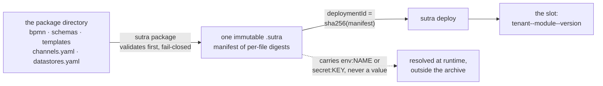
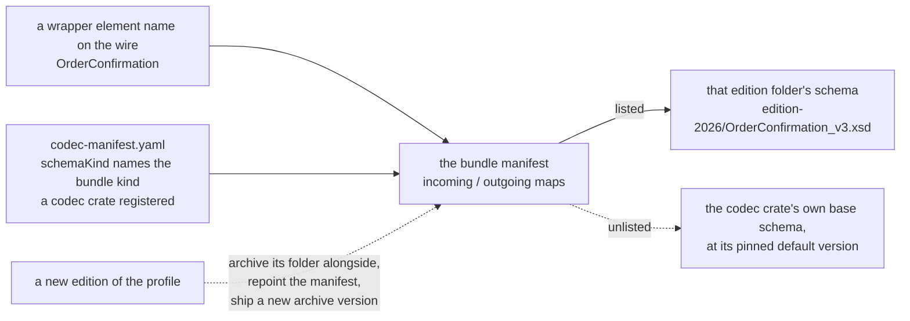

# Deployment packages

A Sutra **project is a single deployment package**. `sutra create app` produces exactly one;
`sutra package <dir>` seals it into one immutable, content-addressed `.sutra` archive; `sutra
deploy` activates that archive on a running engine. There is no build step in between — you
author declarative resources, seal them, and hand the sealed archive to a generic engine binary
that never needs your source. Secrets are the one thing that never travels inside it: a resource
names them by scheme (`env:NAME`, `secret:KEY`, `vault:…`), resolved at runtime, and package-time
validation rejects a literal outright (see [Channels and transports](channels.md)).



Everything the engine needs to run the module is sealed and hashed, so identical bytes re-deploy as
a no-op and the same archive promotes across environments unchanged — while the values that must
differ per environment stay references it resolves on the way up.

## Package interior

```
<package>/
├── package.yaml             # manifest: labels {tenant, module, version}, engine.minContract
├── bpmn/**/*.bpmn            # BPMN 2.0 processes
├── rules/                    # DMN decision tables (.dmn) + the .srl rule DSL, by extension
├── scripts/**/*.{hbs,xsl,xslt}     # derive/compute (Handlebars + XSLT)
├── templates/                # render output (Handlebars + XSLT)
├── schemas/                  # each leaf folder under here = one codec
│   └── <codec>/*.xsd + codec-manifest.yaml
├── migrations/<store>/**     # per-datastore SQL migrations
├── channels.yaml             # transport channels (bind codec URNs; hot-reloaded on flip)
└── datastores.yaml           # datastore declarations
```

Every artifact folder supports nested subfolders — `bpmn/orders/checkout/…`, `templates/eu/invoices/…`
— and discovery is recursive. `sutra create deployment <name> --from packages/my-app`
scaffolds a sibling package as an explicit copy; **packages never inherit** from one another.

## `package.yaml` — labels, not scope

```yaml
labels:
  "module": "money-transfer"
  "tenant": "default"
  "version": "1.0.0"
engine:
  minContract: 1
```

`tenant` / `module` / `version` are **opaque labels** — selectors for observability, routing, and
row-level-security partitioning (`tenant_id`) — never a resource-tree dimension. A package is
fully self-contained: there is no `tenants/<id>/` overlay tree, no shared-library `modules/`
folder, and no inheritance between packages. What a tenant "sees" is simply every process in the
package deployed under its labels.

## Referencing resources — convention over configuration

Because the package is self-contained, resources are referenced by their **local key**, derived
from the folder tree — never by `tenant`/`module`/`version`:

| Resource | Resolved by |
|---|---|
| BPMN process | `processId` — globally unique within the package |
| Rule (`.dmn` / `.srl`) | its relative path under `rules/` |
| Script / template | its full relative path (folder + filename + extension) |
| Codec | a URN — see below |

**Codecs are the one exception.** A globally-named codec — a format the engine links in (`json`,
`xml`, `yaml`, `csv`, `raw-text`, `raw-bytes`) or a codec crate a distribution force-links — is
`urn:sutra:codec:<name>`; a package-defined codec is named by its path under `schemas/`, `/`
folded to `:` — `schemas/transfer/` becomes `urn:transfer`, `schemas/hr/employee/` becomes
`urn:hr:employee`. `channels.yaml` binds that URN:

```yaml
# examples/money-transfer/.../channels.yaml
channels:
  - name: transfer-request
    transport: http
    bind: "POST /channels/transfer-request"
    codec: urn:transfer     # schemas/transfer/*.xsd, declared by schemas/transfer/codec-manifest.yaml
```

A `codec-manifest.yaml` sits inside its own `schemas/<codec>/` folder and declares the schema kind
plus the formats the codec accepts:

```yaml
# examples/money-transfer/.../schemas/transfer/codec-manifest.yaml
schemaKind: xsd
formats: [xml, json, yaml]
```

### Tabular formats — `csv` and `fixed-width` {#tabular-formats}

`formats:` is not limited to document syntaxes. A schema codec can bind `csv` or `fixed-width`,
which is what turns a delimited or fixed-column upload from a bag of untyped strings into a typed
message:

```yaml
# examples/call-log-load/.../schemas/cdr/codec-manifest.yaml
schemaKind: xsd
formats: [csv, fixed-width]

csv:
  delimiter: ","          # both default; written here only to show where layout lives
  header: true

fixed-width:
  fields:                 # REQUIRED — a fixed-width line has no structure of its own
    - {name: recordId,    width: 12}
    - {name: msisdn,      width: 16}
    - {name: durationSec, width:  6}
```

A tabular body is a **batch**, so it is validated **row-wise**: each row is checked as one instance
of the declared root, in a single decode, *before the process starts*. Every violation carries a
row-indexed path (`value[3].durationSec`), so a bad cell names its record. An unparseable file is
fatal; any row's violation is a soft error, so the payload still projects and `q:onValidation`
decides the posture. The batch projects under `value`, so a flow reads `payload.value[0].field`.

The XSD's leaf types reach the cells: an `xs:int` column arrives as a number, not `"182"`. An empty
cell reads as **absence** for an element the type declares `minOccurs="0"` — without that, an
optional column would have to be populated in every row. An empty cell for a *required* element is
still a violation.

Both tabular formats may be declared together. Their content types are disjoint — `text/csv` /
`application/csv` against `text/plain` / `application/x-fixed-width` — so an upload selects its
parser unambiguously and one schema serves a CSV feed and a fixed-width feed over the same channel.

Layout is **parser config, not schema**: it cannot be expressed in an XSD or a JSON Schema (neither
has byte offsets), which is why it lives in the manifest. A header-bearing CSV names its own
columns and needs no block at all; a fixed-width codec cannot work without one and declaring the
format without it is a manifest error.

Because a fixed-width layout *is* configuration, its columns are checked against the bound type at
**package time**: a column the type does not declare, or a required element with no column, fails
`sutra lint` (`SUTRA.CONFIG.CODEC_MANIFEST.REJECTED`) rather than every row at runtime. A csv codec
gets no equivalent check — its column names arrive in the header, at runtime, so there is nothing
to compare against beforehand.

The opaque formats (`raw-text`, `raw-bytes`) are not schema-bindable: there is no map under raw
bytes for a schema to type, so binding one is refused with that reason.

The reserved token `sutra` may not be used as a first-level subfolder name under any artifact
folder (`schemas/sutra/`, `bpmn/sutra/`, …) — that would collide with the engine's own
`urn:sutra:*` namespace. A deeper `sutra` (`schemas/hr/sutra/`) is fine.

## Schema bundles — when a codec is a whole profile {#schema-bundles-when-a-codec-is-a-whole-profile}

`schemaKind: xsd` and `schemaKind: json-schema` are the generic case: a folder of schema files the
engine validates a decoded document against. Some standards aren't that shape at all — they're a
whole **profile**: an envelope grammar, a mapping from a wire-level message name to a schema file,
and versioned editions the profile revs on its own release cadence, independent of Sutra releases.
For those, `schemaKind` names a **bundle kind** a codec crate has registered (see [Domain
neutrality and the SPI model](../architecture/neutrality-and-spi.md#bundle-codec-kinds)),
and the folder's job shifts from "here are the schemas" to "here is the configuration that decides
which schema backs which message, for this archive version."

A codec crate registers its own bundle kind this way whenever the standard it serves is a whole
profile rather than a bare schema folder — say, a market venue that publishes a wrapper envelope
around every message and revs its schema editions on its own release calendar. That codec crate is
a proprietary extension, not part of this distribution — the mechanism below is generic; naming a
concrete kind is only for illustration. Its manifest maps **wrapper element names** — not a bare
schema namespace — onto schema files archived alongside it:

```yaml
# schemas/<your-kind>/codec-manifest.yaml
schemaKind: <your-kind>
```

```yaml
# schemas/<your-kind>/<your-kind>-manifest.yaml
appHdr: edition-2024/Header_v1.xsd   # optional
incoming:
  OrderConfirmation: edition-2026/OrderConfirmation_v3.xsd
outgoing:
  OrderConfirmation: edition-2026/OrderConfirmation_v3.xsd
  ShipmentNotice: edition-2024/ShipmentNotice_v2.xsd
```

```
schemas/<your-kind>/codec-manifest.yaml      # schemaKind: <your-kind>
schemas/<your-kind>/<your-kind>-manifest.yaml   # appHdr? / incoming{wrapper: relpath} / outgoing{wrapper: relpath}
schemas/<your-kind>/<edition-folder>/*.xsd   # free-form folder names — the manifest is the only truth
```

A few things fall out of that shape:

- **Edition folders sit side by side.** Because the venue revs its schemas per release (the same
  wrapper can move from one schema version to the next between editions), archiving each release's
  files under its own folder and repointing the manifest is how a module adopts a new edition — a
  new version of the archive, no engine or codec change.
- **An unlisted wrapper falls back to the codec crate's own base schema** for its pinned default
  version, so a bundle only needs to carry the wrappers it actually wants to validate more strictly
  than that default — the codec stays useful with zero configuration otherwise.
- **An enriched edition can be licensed material.** A codec's base schemas may be freely
  redistributable while a fuller, usage-guideline edition is a licensed product participants obtain
  themselves and supply in their own archive — the engine never ships that tier, and neither does
  any artifact built from this repository.
- **Registration is deployment-scoped**, exactly like every other artifact under the
  registration model: the bundle's registry key is
  `urn:sutra:codec:<folder-path-with-'/'-folded-to-':'>:<deploymentId>`. Naming the folder
  `<your-kind>` shadows the globally-registered `urn:sutra:codec:<your-kind>` **for that deployment
  only** — a second version of the same module with a different edition mapping registers under its
  own `deploymentId` and runs side by side, no collision.
- **Deploy-time errors are fail-closed**: an unknown wrapper name, a wrapper listed under the
  wrong direction, a missing or uncompilable schema file, or a schema whose namespace doesn't match
  the expected one all reject the archive rather than deploy something that silently validates less
  than the manifest claims.



The manifest is the only truth about which schema backs which message — the folder names carry no
meaning — so adopting a new edition is a package change and a new `deploymentId`, never an engine
or codec-crate change.

## Store migrations, and evolving a projected structure {#store-migrations-and-schema-evolution}

Every `sql` data store the package declares brings its **own** schema, under a folder named for the
store:

```
migrations/<store-id>/V001__<description>.sql
migrations/<store-id>/V002__<description>.sql
```

`<store-id>` is the store's `name` in `datastores.yaml`, and the `migrations:` key of that store
points at the folder (`migrations: migrations/accounts`). The scripts are yours: your dialect, your
table names, your indexes and seed rows. The engine generates no DDL for a module store.

**One store is the exception**: the reserved `coverage` store, where path-coverage marks are
persisted. Its declaration still picks the database, but the engine owns its schema — it ships that
DDL per dialect and applies it to the connection on the same first-use path — so the store block
carries no `migrations:` key and a package carries no `migrations/coverage/` folder. See
[Coverage: declared routes as the compliance signal](coverage.md#where-coverage-is-stored).

Three properties of how the package's own scripts run are worth designing around:

- **Applied in `V<n>__` order, once per store instance**, before the store serves its first
  operation — and serialized across replicas, so two engines booting at once don't race.
- **There is no migration ledger.** The engine's own Flyway-style history table covers engine
  tables only; a module store's scripts are simply re-run on the next boot. **Write them
  idempotently** — `CREATE TABLE IF NOT EXISTS`, `INSERT … ON CONFLICT DO NOTHING`,
  `CREATE INDEX IF NOT EXISTS` — because that is what makes the re-run a no-op rather than a
  failure.
- **A store's data carries across a version bump.** There is no `deployment_id` on a business
  store's rows: deploying `1.0.1` beside `1.0.0` doesn't fork the data, and that is the feature,
  not an oversight.

### When a projected structure changes

A store that declares a [`structure:` block](data-stores.md#typed-columns-declaring-the-structure-a-store-holds)
adds one obligation: a changed structure ships with the migration that makes the table match, in
the same package. `sutra lint` derives the effective table shape from these very scripts, so it
tells you at package time whether the pair is consistent — its job is to *detect* the mismatch, not
to repair it.

| Change to the declared type | What it costs |
|---|---|
| Add an **optional** scalar field | Additive. A new nullable column; rows written before it read the field as absent |
| Add a **required** scalar field | Lint error until the column exists *and* is nullable or has a `DEFAULT` — existing rows cannot satisfy a bare `NOT NULL` |
| Remove a field | The column becomes unmapped (a warning); existing data is untouched |
| Widen a facet (`maxLength` 35 → 70) | Lint error until the `ALTER` ships in a new `V…` script; clean once it does |
| Rename a field | Modelled as remove + add. A `columns:` mapping can keep the physical column name instead |
| **Scalar → nested or repeated** | Hard stop: `STRUCTURE_NOT_FLAT`. Either keep the field flat, or drop the `structure` block and go back to the opaque store — an explicit decision at package time, never a silent shape change |

What follows from the table is a packaging rule: **a type change and the `ALTER` that supports it
belong in the same package.** Lint replays every script in the folder in version order and compares
the result against the declared type as it stands, so a package carrying both lands clean, while
one carrying only the type change fails the gate rather than the deployment.

## Building one by hand vs. scaffolding

`sutra create app <name>` (see [Anatomy of an app](../getting-started/first-app.md)) generates a
package in this exact shape, verified through the engine's own loaders before anything is
written. Growing it from there:

```bash
sutra create bpmn my-process --package packages/my-app --validation fatal
sutra create deployment my-app-eu --from packages/my-app   # explicit variant copy
```

`sutra lint <package-dir>` runs the full package-time validation suite (the same checks `sutra
package` runs before sealing) with no output on success — the fast pre-flight to run before every
`package`.

## Next

- **[Channels and transports](channels.md)** — how `channels.yaml` binds a transport, a codec,
  and an ack mode.
- **[The q: namespace](q-namespace.md)** — the BPMN extension vocabulary that wires a process to
  its channel.
