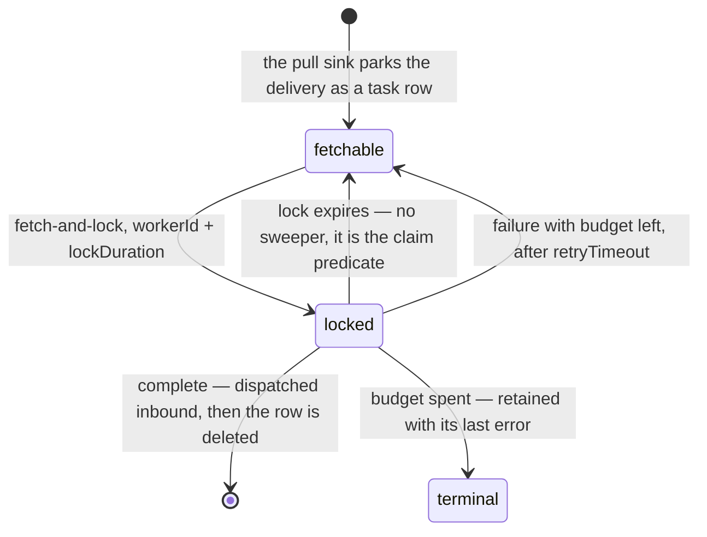
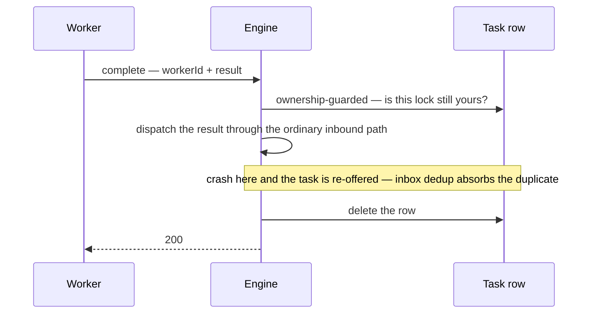

# External tasks: the pull worker surface

The engine is otherwise push-only: an outbound emission lands in the outbox and the relay dials a
transport. A channel declaring `transport: pull` inverts that last hop — instead of dialing
anything, the delivery is **parked as a fetchable task**, and workers come and get it.

That is the whole feature. It exists for work the engine cannot dial out to: a worker behind a
NAT, on a laptop, in a language that has no inbound listener, or simply one that would rather poll
than be called.

## Declaring a pull channel

```yaml
channels:
  - name: score-request
    transport: pull
    bind: "pull://acme/scoring/1.0.0/score-request"
```

Nothing in the BPMN changes. A `<q:send>` or a channel-call `<bpmn:serviceTask>` targeting this
channel behaves exactly as it would over HTTP or a broker; only the last hop is different. And
because the worker's answer comes back in on the same channel, the author's `<q:alias>`
correlation is unchanged too — a pull task is not a new resume path.

Pull needs a datasource: a parked task is a database row. Without one the surface answers `503`.

## The worker protocol

Three operations, all under `/sutra/external-tasks`.

### Fetch and lock

```
POST /sutra/external-tasks/fetch-and-lock
{ "workerId": "scorer-7", "channels": ["score-request"],
  "lockDuration": "PT1M", "maxTasks": 10, "asyncResponseTimeout": "PT20S" }
```

Claims up to `maxTasks` fetchable tasks on the named channels and locks them to `workerId`. A
worker names **topics** (channel names), never deployment ids — the fetch walks the live
deployment set for you.

When nothing is available the request is held open as a **bounded long poll**: it wakes the moment
a task is parked on one of the channels you asked for, and answers with an empty list when
`asyncResponseTimeout` elapses. It never hangs, and the wait is always bounded by the operator's
ceiling.

Each returned task carries its id, channel, instance id, headers, body and content type, its
attempt count, and its remaining failure budget.

### Complete

```
POST /sutra/external-tasks/{id}/complete
{ "workerId": "scorer-7", "result": { ... } }
```

Feeds the worker's result back through the engine's **ordinary inbound path** — the same seam
every transport delivers through. Correlation, validation, and inbox dedup all behave exactly as
they do for a pushed reply; there is no second resume entry point.

Omitting the result re-delivers the original request payload. That is the fire-and-forget shape:
the work happened outside, and the flow is waiting only on the *fact* of it.

### Failure

```
POST /sutra/external-tasks/{id}/failure
{ "workerId": "scorer-7", "errorMessage": "downstream 500", "retries": 2, "retryTimeout": "PT30S" }
```

Releases the lock and spends one of the task's retries — or sets the remaining budget explicitly —
deferring the next fetch by `retryTimeout`.

## Lock expiry is the only recovery mechanism you need

A locked task is invisible to every other worker until its lock **expires**, at which point it
becomes fetchable again. There is no sweeper, no reaper, and no timeout job: expiry is part of the
predicate that decides what a fetch may claim, so a worker that dies mid-task costs exactly one
lock duration and never costs the work.



There is no reaper because an expired lock is not a state anyone has to clean up: it is simply no
longer an obstacle to the next fetch, so availability is instant rather than one sweep tick late.

A completion or failure from a worker that no longer owns the lock **fails closed**, and the
refusal names which of the three situations it is:

| Code | Meaning |
|---|---|
| `SUTRA.EXTERNAL_TASK.LOCK_LOST` | Your lock expired or was released. The task is fetchable again — by you or by anyone. |
| `SUTRA.EXTERNAL_TASK.LOCK_HELD` | Another worker holds it. |
| `SUTRA.EXTERNAL_TASK.TERMINAL` | The task spent its budget and can never be completed or failed again. |
| `SUTRA.EXTERNAL_TASK.NOT_FOUND` | No such task on any live deployment. |

A stale worker never receives a `200` it could mistake for success.

## At-least-once, and what makes that safe

The task row is deleted **only after** the engine has accepted the completion. A crash in the
window between the two re-offers the task, so the work is never lost — the surface is
at-least-once, deliberately, because the inverse ordering (delete, then dispatch) would be
at-most-once and would drop work outright on the same crash.



The ordering is the whole guarantee: the crash window can only produce a duplicate the idempotency
key already absorbs, where the inverse order would lose the work with nothing recording that it
ever happened.

What makes the duplicate harmless is that each task carries the originating outbound delivery's
key as an **explicit idempotency key**, and the completion re-enters under it. Inbox dedup absorbs
the second attempt. A worker does not have to do anything to get this — it is a property of the
surface, not of the worker.

If the engine *refuses* a completion on the inbound path (a validation reject, say), the answer is
`422` with the engine's own code carried as `attributes.causeCode` — which is what tells the
worker whether re-fetching later can ever help. The task is retained and becomes fetchable again.

### Two reserved headers a worker never sees

For completeness: internally, the dispatcher stamps two reserved headers —
`sutra-park-deployment` and `sutra-park-instance` — onto a delivery whose destination scheme is
`pull`, and the pull sink strips them as it parks the task. They carry the owning deployment (the
isolation key) and instance to the parking side without widening the transport contract every
other sink implements, and the scheme gate means they can never leak onto a network transport.
They never appear in a fetched task's headers; nothing a worker builds should look for them, and
their presence in a payload you construct yourself has no effect — the sink's own stamp always
wins.

## The worker retry budget

A freshly parked task starts with `sutra.external-task.retries` failures (default 3). Each
reported failure spends one and defers the next fetch by `sutra.external-task.retry-timeout`
(default `PT10S`).

A **spent budget makes the task terminal**: never fetched again, retained with its last error.
That is the pull-side twin of the outbox's poison horizon, and it exists for the same reason — so
"we gave up" can never degrade into "it silently vanished". A terminal task no longer counts
toward its deployment's [retirement quiescence
gate](../architecture/replicas.md#retiring-a-draining-deployment-a-three-legged-gate).

## Bounds are rejections, never clamps

Every knob a worker can send is a **ceiling an operator sets**, and a request over the ceiling is
a `400` — not a silent adjustment down:

| Key | Default | Ceiling on |
|---|---|---|
| `sutra.external-task.default-lock-duration` | `PT30S` | The lock granted when a fetch names none; also the completion grace window. |
| `sutra.external-task.max-lock-duration` | `PT1H` | `lockDuration`. |
| `sutra.external-task.max-async-response-timeout` | `PT30S` | `asyncResponseTimeout` (and its default). |
| `sutra.external-task.max-tasks` | `100` | `maxTasks` (and its default). |
| `sutra.external-task.retries` | `3` | The starting failure budget. |
| `sutra.external-task.retry-timeout` | `PT10S` | Backoff before a failed-with-budget task is fetchable again. |

The reason it is a reject is a correctness one: a worker that *believes* it holds a longer lock
than it actually does is a duplicate-execution bug waiting to happen. Silently clamping would
create exactly that belief. Durations are ISO-8601 everywhere on this surface, the same grammar
the engine's cadence keys and `<q:retry>` use.

The engine also boots fail-closed if `default-lock-duration` exceeds its own ceiling or is zero.

## Posture

These are **operate**-surface routes (`/sutra/*`), not administrative ones: a completion is an
ordinary delivery, not a privileged control operation. They carry the same cluster-internal
posture the rest of `/sutra/*` does. A deployment that needs authenticated workers puts them
behind the same ingress policy the rest of the operate surface already needs — see
[Configuration reference](../operating/configuration.md#admin-api-auth) for the separately gated
admin surface.

## How it composes with `<q:retry>` {#how-it-composes-with-qretry}

Two budgets, at two layers, that never overlap:

| | Governed by | Counts | On exhaustion |
|---|---|---|---|
| **Worker failures** | `sutra.external-task.retries` (operator config) | A worker reporting a failure on a fetched task | The task turns terminal; the instance stays parked on its wait |
| **Task failures** | `<q:retry>` (the author's model) | A route-less `<q:timeout>` firing, or a poisoned request delivery | The instance fails durably |

A worker retrying its own work never touches the instance. A `<q:retry>` policy on a pull-backed
channel call still governs the task-level outcome — its timeout is still the thing that eventually
fires if no worker ever completes. See
[Retries, history, and schedules](retries-history-schedules.md#qretry--a-per-task-retry-policy).

## Next

- **[Channels and transports](channels.md)** — where `transport:` is declared and what the other
  transports do.
- **[Wait states and human tasks](wait-states.md)** — the park/resume model a pull task rides on.
- **[Configuration reference](../operating/configuration.md#external-tasks-the-pull-worker-surface)**
  — the key family in full.
- **[The pull surface: the design reasoning](../internals/pull-surface-design.md)** — ownership
  transfer, why zero rows affected is never success, and why there is no sweeper.
