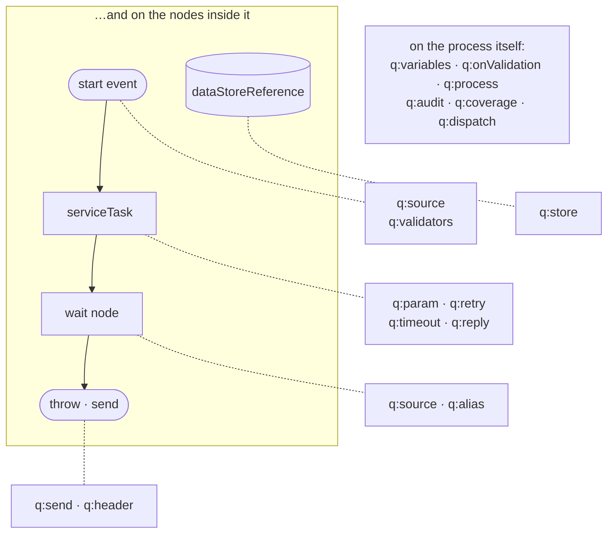
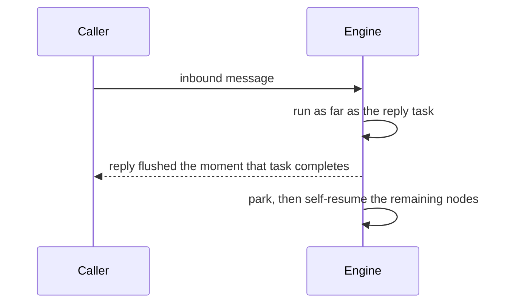

# The `q:` namespace

Standard BPMN 2.0 has no opinion on channels, message types, correlation, or replies. Sutra adds a
small, layered set of extension elements — the `q:` namespace, `urn:sutra:q:1.0` — that live
entirely inside `<bpmn:extensionElements>`, so a Sutra process is still a valid, portable BPMN 2.0
diagram; the `q:` attributes just tell the engine how to wire it to the outside world. The
authoritative shape is `xsd/q.xsd`; the engine's parser validates every `<q:*>` element against it,
and the same XSD drives the `sutra-modeler-plugin` property panels.

```xml
<bpmn:definitions xmlns:bpmn="http://www.omg.org/spec/BPMN/20100524/MODEL"
                  xmlns:q="urn:sutra:q:1.0" ...>
```

## At a glance

| Element | Attaches to | What it declares |
|---|---|---|
| `q:source` | start events, wait-capable nodes | The inbound trigger: channel, message type, ack mode, dedup, data class. |
| `q:validators` / `q:redactors` | `q:source` | The validation and redaction chains over the decoded payload. |
| `q:alias` | wait-capable nodes | A correlation key derived by FEEL — how a later inbound finds the parked instance. |
| `q:reply` | tasks | An outbound reply on the inbound's own channel; `continue="true"` is respond-and-continue. |
| `q:send` | throw events, send tasks | An unsolicited outbound message to a channel destination. |
| `q:header` | `q:send` / `q:reply` | An author-declared outbound header. |
| `q:param` | `bpmn:serviceTask` | A scoped, per-invocation input to a registered task or template. |
| `q:retry` | registered-task **and** channel-call `bpmn:serviceTask` | Per-task retry policy — attempts, backoff, non-retryable codes. |
| `q:timeout` | channel-call `bpmn:serviceTask` | Synthesizes a timer boundary on the call. |
| `q:store` | `bpmn:dataStoreReference` | Binds the reference to a durable key in a declared data store. |
| `q:dispatch` / `q:case` | `bpmn:process` | Content-based dispatch to called elements. |
| `q:variables` / `q:variable` | `bpmn:process` | Declared process variables — type or schema, `transient` / `sensitive` / `source`. |
| `q:onValidation` | `bpmn:process` | The structural-failure policy (`route` / `reject` / `error`). |
| `q:process` | `bpmn:process` | The retry-safety (idempotency) assertion. |
| `q:audit` | `bpmn:process` | Audit capture level and data-class tagging. |
| `q:coverage` | `bpmn:process` | An opt-in tracked compliance path. |



Nothing in the vocabulary is a new node type: every element hangs off a standard BPMN element's
extension elements, which is why a process carrying all of it is still a valid, portable BPMN 2.0
diagram.

## `q:source` — the inbound trigger

Every message-consuming node — a start event or a wait-state catch — declares exactly one
`q:source`. It names the channel, the message type it accepts, and the variable the decoded
payload lands in:

```xml
<bpmn:startEvent id="Start">
  <bpmn:extensionElements>
    <q:source channel="transfer-request" messageTypeValue="TransferRequest"/>
  </bpmn:extensionElements>
</bpmn:startEvent>
```

- `channel` (required) — the `channels.yaml` channel name.
- `messageTypeValue` / `messageTypePattern` — subscribe to one exact type, or a family via regex,
  matched against the codec's decoded message type. Neither set = accept anything the channel's
  codec yields.
- `name` (default `payload`) — the process-variable name the decoded body is projected under
  (`payload.fromId`, `payload.body.CdtTrfTxInf...` for a structured codec).
- `ack` (default `on-persist`) — see [Acknowledgement modes](../operating/ack-modes.md).
- `dedupKey` — an expression identifying a redelivered duplicate (e.g. `header.X-Request-Id`),
  distinct from the process-level retry-safety assertion below.
- `dataClass` (default `none`) — `pii` / `pci` / `phi` / `financial`; drives redaction policy.

The codec itself is **not** declared on `q:source` — it comes from the channel (YAML is
authoritative for transport/codec binding; BPMN is authoritative for process flow). Declaring a
codec on `q:source` is a parse error.

### `q:validators` and `q:redactors` (nested under `q:source`)

```xml
<q:source channel="transfer-request" messageTypeValue="TransferRequest">
  <q:validators>
    <q:complexValidator source="transfer-limits.dmn"/>
    <q:complexValidator source="transfer-fields.srl"/>
    <q:simpleValidator ref="iso-4217-currency" path="payload.amount.currency"/>
  </q:validators>
  <q:redactors>
    <q:redactor ref="pci"/>
  </q:redactors>
</q:source>
```

`q:validators` is a mixed, ordered container: a `q:complexValidator` runs a whole-payload ruleset
(a `.dmn` or `.srl` file, or a built-in like `iso-xsd`) — a chain can mix `.dmn` and `.srl` entries
freely, run in declaration order, with every entry's issues accumulating into one result (see
[Composing a validator chain](rules.md#composing-a-validator-chain)); a `q:simpleValidator` checks
one field at a FEEL `path` against a registered content validator (`iso-3166-country`,
`iso-4217-currency`, `iso-9362-bic`). `q:redactors` names registered `ContentRedactor`s that mask
sensitive spans in every observability surface (audit, logs, traces) without touching the value
the flow actually sees.

## `q:reply` and `q:send` — outbound

```xml
<bpmn:serviceTask id="OkReply" implementation="transfer-result.hbs">
  <bpmn:extensionElements>
    <q:reply mode="native" contentType="application/xml"/>
  </bpmn:extensionElements>
</bpmn:serviceTask>
```

`q:reply` answers the caller that started this instance — `mode="native"` (default) preserves the
symmetric reply behavior, or emit a CloudEvent (`cloudevent-binary` / `cloudevent-structured` /
`match-inbound`). `q:send` is the unsolicited counterpart — an intermediate throw event emitting to
its own destination (`@destination` or `@channel`), with no inbound caller to answer. Both accept
`<q:header name="…" value="…"/>` children carrying FEEL-derived values onto transport
headers/application-properties.

`q:reply`'s `continue="true"` is respond-and-continue: flush the reply the moment the task
completes, then park the instance and self-resume the remaining nodes asynchronously — the caller
gets its answer without waiting on the tail of the flow.



The caller's answer is bounded by the task that produces it rather than by the tail of the process
— the remaining nodes run on a resume nobody is waiting on.

## `q:alias` — correlation by your business key

```xml
<q:alias name="e2eId" expression="payload.E2EId" unique="true" onConflict="correlate"/>
```

A friendly key derived from a FEEL expression over the process variables — durable, and
re-evaluated on rehydration. `unique="true"` with `onConflict="correlate"` is what lets a later
message on a different channel find and resume the exact parked instance it belongs to, by a key
*you* named (an `EndToEndId`, an order reference) rather than an engine-internal id. See
[Wait states and human tasks](wait-states.md).

## `q:retry` — per-task retry policies {#qretry--per-task-retry-policies}

```xml
<bpmn:serviceTask id="Score" implementation="registered:score">
  <bpmn:extensionElements>
    <q:retry maxAttempts="3" initialDelay="PT1S" backoffCoefficient="2.0"
             maxDelay="PT5M" nonRetryableCodes="SUTRA.TASK.VALIDATION"/>
  </bpmn:extensionElements>
</bpmn:serviceTask>
```

Valid on **both** kinds of `<bpmn:serviceTask>` — a registered task and a channel-call task
(`implementation="channel:<name>"`). `maxAttempts` is the total invocation budget including the
first attempt; attempt *n+1* waits `min(initialDelay × backoffCoefficient^(n-1), maxDelay)`;
`nonRetryableCodes` names structured codes that fail immediately regardless of budget.

The load-bearing property: **a retry wait is a durable timer park, never a sleep.** The instance
persists with the failed task still pending and an armed timer at the backoff instant, so the
backoff survives restarts and hot-deploys and blocks no execution lane.

What counts as a failed attempt is deliberately narrow. On a registered task: an uncaught error
from the task function. On a **channel-call** task, exactly two things — the route-less
`<q:timeout>` boundary firing, and the request delivery being terminally poisoned by the outbox
attempt ceiling. A correlated **business response is never a retry trigger** (the counterpart
answered; re-sending would double-submit), and BPMN errors always route to their boundaries
instead. Because a modelled outcome always beats a policy, a channel-call `<q:retry>` requires the
route-less `<q:timeout>` form — a timer boundary with drawn outgoing flows alongside a retry
policy is a load error.

Full treatment, including the re-drive's fresh-idempotency-key contract and what exhaustion does:
[Retries, history, and schedules](retries-history-schedules.md#qretry--a-per-task-retry-policy).

## `q:timeout` — a deadline on a channel call

```xml
<bpmn:serviceTask id="Score" implementation="channel:score-request">
  <bpmn:extensionElements>
    <q:timeout duration="PT2M"/>
  </bpmn:extensionElements>
</bpmn:serviceTask>
```

Synthesizes a timer boundary on the call, so a counterpart that never answers cannot park the
instance forever. Without a `<q:retry>` alongside it, a fired route-less timeout is a catchable
BPMN error; with one, it is a retryable task failure first.

## `q:store` — durable, cross-instance data

```xml
<bpmn:dataStoreReference id="dsrFrom" name="accounts" dataStoreRef="accountsStore">
  <bpmn:extensionElements>
    <q:store key="payload.fromId" forUpdate="true"/>
  </bpmn:extensionElements>
</bpmn:dataStoreReference>
```

Binds a `<bpmn:dataStoreReference>` to a key in a `datastores.yaml`-declared store. `forUpdate`
takes a pessimistic row lock (serializes concurrent writers on the same key); `field` replaces one
field of a stored map value; `expect="unchanged"` is an optimistic compare-and-set instead of a
lock. See [Data stores](data-stores.md).

## `q:dispatch` / `q:case` — a routing table instead of gateway sprawl

```xml
<q:dispatch default="fallback" onNoMatch="error">
  <q:case when="payload.type = 'A'" calledElement="handle-a"/>
  <q:case when="payload.type = 'B'" calledElement="handle-b"/>
</q:dispatch>
```

A declarative dynamic call-activity dispatch — one FEEL condition per case, instead of an
exclusive gateway fanning into N call activities.

## `q:onValidation` — the structural-failure policy

```xml
<q:onValidation mode="route" errorCode="T505"/>
```

`mode="route"` surfaces the `validation` summary (`outcome`, `tier`, `firstReasonCode`,
`firstIssue`, `issues`) as variables so the BPMN's own gateway decides what to do; `reject` /
`error` short-circuit. The engine never interprets what
a soft error *means* — that decision stays in your process, which is what keeps the engine
domain-neutral.

The three modes are not interchangeable:

| Mode | What happens |
|---|---|
| `route` | the payload reaches the flow; you triage `payload.validation.issues` yourself |
| `reject` | the message is refused at intake; no instance starts; the caller gets the issue list |
| `error` | a BPMN error is raised *into* the flow, for an error boundary or event sub-process to catch |

**Declaring nothing means `reject`.** An intake that carries a validation *contract* — a
schema-backed codec, or a declared `<q:validators>` chain — and states no policy refuses a failing
payload rather than passing it on. A flow that says nothing about handling failure has no handler
for it by definition, so the failure must not enter it.

That default is `reject` rather than `error` deliberately: `error` is still the flow taking
control, and raising a BPMN error into a process with no matching boundary reports "uncaught BPMN
error" instead of naming the offending field — a worse diagnostic for the same refusal.

Schema-less ingress is untouched. A channel binding a bare format (`csv`, `json`, …) has no
contract to fail, and the format layer is fail-open by construction, so nothing changes there.

If you want the payload through regardless, say so — `<q:onValidation mode="route"/>` — and the
intent is visible in the diagram instead of resting on a default. `sutra lint` warns
(`SUTRA.CONFIG.VALIDATION.POSTURE_UNDECLARED`) on any contract-bearing intake that declares no
policy, naming both choices.

## `q:process` — the retry-safety assertion

```xml
<bpmn:extensionElements><q:process idempotent="true"/></bpmn:extensionElements>
```

Hung off the `<bpmn:process>` itself. `idempotent="true"` is your assertion that re-running this
process on the same input converges to one end state — so a redelivered message is safe to
re-process any number of times. The default is `false` (fail-closed): an execution failure on a
non-idempotent process is consumed (ack, no requeue) and recorded as an incident rather than
blind-retried. This is a different concern from `q:source`'s `dedupKey`, which only detects that a
message *is* a redelivery — it says nothing about whether re-processing it is safe.

**What the assertion gates, and what it does not.** It governs the *failure* path: whether a
delivery that failed is requeued or dead-lettered. It does **not** gate replay after a park. An
instance that parks — at a wait node, a `<q:retry>` backoff, or a `<q:reply continue="true">` — is
re-driven at-least-once by the durable poller, unconditionally. A multi-instance loop is one
durable step, so a crash mid-loop replays it from the first item rather than resuming where it
stopped.

Both rest on the same property: every effect the flow repeats must converge. A store write keyed
by something derived from the record does (re-writing is an upsert). A `<q:send>`, an append, or a
counter increment does not — and no assertion makes it so. Declaring `idempotent="true"` over
effects that do not converge does not make replay safe; it only changes what happens after a
failure.

## `q:variables`, `q:audit`, `q:coverage`

- **`q:variables`** — declares process variables up front (name + scalar type or a schema
  reference), so deploy-time static validation can check every FEEL path against them, and mark a
  variable `transient` (never persisted, so it is dropped at any park — reading it after a wait
  state, a `<q:retry>` backoff or a `<q:reply continue="true">` is a validation error; it is for
  scratch that is re-derived, never for anything the flow still needs on the other side),
  `sensitive` (persisted but redacted downstream), or `source`-bound (payload-initialized from a
  named channel).
- **`q:audit`** — per-process audit sink/target/capture-level configuration.
- **`q:coverage`** — declares one tracked compliance route (`path` id + the ordered `flows` it must
  traverse) for the path-coverage reporting the CLI's `sutra coverage` commands drive. This is the
  intra-process half of the mechanism; a route spanning several correlated processes is declared
  differently. See [Coverage: declared routes as the compliance signal](coverage.md) for both
  shapes, the curation guidance, and the CLI walkthrough.

## Next

- **[Rules: DMN, FEEL, and .srl](rules.md)** — the decision layer these expressions run on.
- **[Retries, history, and schedules](retries-history-schedules.md)** — `q:retry` and `q:timeout`
  end to end, plus timer definitions and execution history.
- **[Worked example: money-transfer](worked-example.md)** — most of the elements on this page, in
  one real process.
