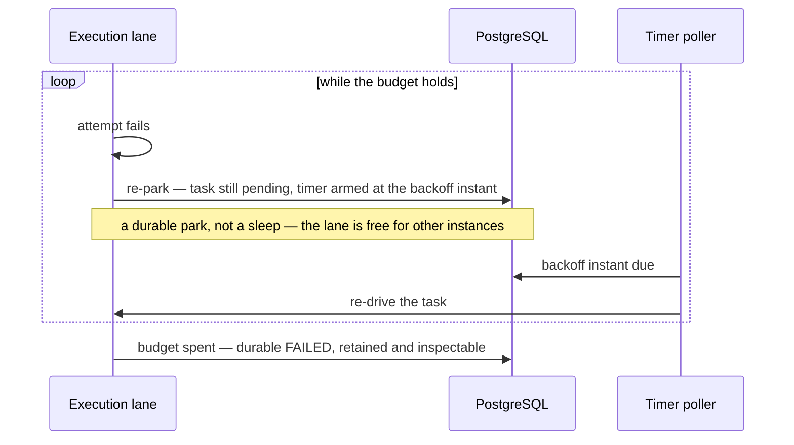
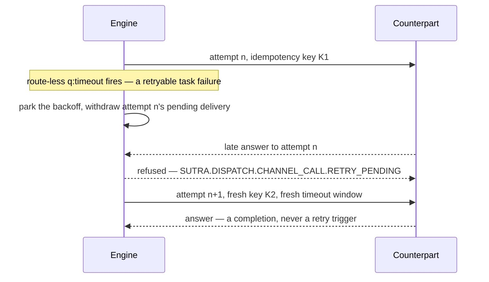
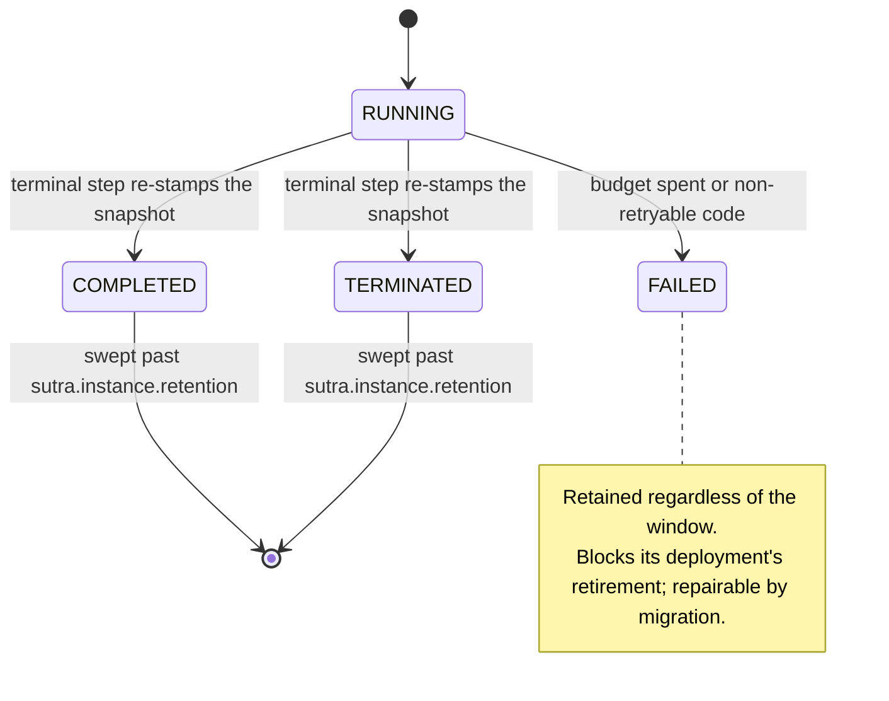

# Retries, history, and schedules

Three execution-semantics features an author reaches for once a flow has to survive contact with
an unreliable world: a per-task **retry policy**, **execution history** that outlives the
instance, and the full set of BPMN **timer schedules**.

## `<q:retry>` — a per-task retry policy {#qretry--a-per-task-retry-policy}

A `<bpmn:serviceTask>` may declare a retry policy inline. It applies to both kinds of service
task: a **registered task** (a function the embedding application registered) and a
**channel-call task** (`implementation="channel:<name>"` — the wait-state call every pure-BPMN
deployment uses through the shipped binary).

```xml
<bpmn:serviceTask id="Score" implementation="registered:score">
  <bpmn:extensionElements>
    <q:retry maxAttempts="3" initialDelay="PT1S" backoffCoefficient="2.0"
             maxDelay="PT5M" nonRetryableCodes="SUTRA.TASK.VALIDATION"/>
  </bpmn:extensionElements>
</bpmn:serviceTask>
```

| Attribute | Default | Meaning |
|---|---|---|
| `maxAttempts` | required | Total invocation budget, **including the first attempt**. |
| `initialDelay` | `PT1S` | Wait before attempt 2. |
| `backoffCoefficient` | `2.0` | Delay multiplier — attempt *n+1* waits `min(initialDelay × coefficient^(n-1), maxDelay)`. |
| `maxDelay` | `PT5M` | Ceiling on any single backoff wait. |
| `nonRetryableCodes` | — | Structured codes that fail immediately, budget notwithstanding. |

So `maxAttempts="4" initialDelay="PT1S" backoffCoefficient="2.0"` waits 1 s, then 2 s, then 4 s
between its four attempts — each capped at `maxDelay`.

### A retry wait is a durable park, never a sleep

This is the load-bearing property. A failed attempt with budget remaining **persists** the
instance with the failed task still pending and an armed timer due at the backoff instant; the
ordinary timer poller re-drives it when that instant arrives.

Nothing sleeps, and nothing is held in memory. The consequences are the ones you want:

- the backoff survives a restart, a rolling upgrade, and a hot-deploy (a retry park is pinned to
  its deployment like every other park);
- no execution lane is blocked during the wait, so a task backing off costs other instances
  nothing;
- a `PT5M` backoff is a `PT5M` backoff whether or not the replica that started it is still alive.



A backoff is a row in a database, not a held thread — which is why it survives a restart and a
hot-deploy, and why a task waiting five minutes costs every other instance nothing.

Declaring `<q:retry>` on a task makes its process **stateful** — the park needs persistence, so a
process that was otherwise run-to-completion now requires a configured datasource.

### What counts as a failed attempt

The failure set is deliberately narrow and different for each task kind.

**On a registered task**: an uncaught error from the task function.

**On a channel-call task**, exactly two things:

- the route-less `<q:timeout>` boundary firing before the correlated response arrived
  (classification `SUTRA.DISPATCH.CHANNEL_CALL.TIMEOUT`). Without a policy a fired timeout is a
  catchable BPMN error; *with* one it becomes a retryable task failure first;
- the request delivery being marked terminally poisoned by the outbox attempt ceiling
  (classification `SUTRA.OUTBOUND.DELIVERY_ATTEMPTS_EXHAUSTED`, reachable only when
  `sutra.outbox.retry.max-attempts` is configured). The failure reaches the task the moment the
  delivery gives up, rather than waiting out the whole timeout window.

Both classifications are stable structured codes, so `nonRetryableCodes` can name them — "retry a
poisoned delivery but never a timeout" is expressible.

**What is never a failed attempt:**

- **A correlated business response.** The counterpart answered. Whatever the answer *says* is the
  process's business to route on; re-sending would double-submit. A response is a completion,
  full stop.
- **A BPMN error.** Errors route to their boundary events, unchanged, on either task kind.

### Modelled outcomes always beat a policy

A timer boundary event *with drawn outgoing flows* is a modelled outcome — the author has said
what happens on timeout, so that is what happens, exactly as a BPMN error routes to its boundary
instead of consuming a retry budget. Which is why the loader **refuses** the combination: a
channel-call `<q:retry>` requires the route-less `<q:timeout>` form, and a routed timer boundary
alongside a retry policy is a load error (`SUTRA.CONFIG.BPMN.RETRY_NOT_APPLICABLE`). A policy that
could never fire would otherwise load as a silent near-no-op.

### What a re-drive actually does on a channel call

Re-driving a channel call is not "wait for the same answer again" — it **re-issues the request**:

- a **fresh** outbound request built from the same persisted variables, with a **fresh
  idempotency key** on the wire (so a counterpart doing its own dedup sees a genuinely new
  request, not a redelivery);
- a **fresh** timeout window;
- the dead attempt's outstanding request **withdrawn**, so a late answer to a superseded attempt
  cannot race the new one.

A response that arrives for the dead attempt is refused with
`SUTRA.DISPATCH.CHANNEL_CALL.RETRY_PENDING` — an honest verdict rather than a "no such instance"
miss, because the correlation is deliberately kept alive. Once the re-issued request goes out, the
same correlation serves its response normally.



A re-drive is a new request rather than a second wait for the old one, so the counterpart's own
deduplication sees it as new; and the superseded attempt is refused by name instead of being
silently absorbed or lost.

### Exhaustion

A spent budget — or a `nonRetryableCodes` hit — fails the instance durably with
`SUTRA.RUNTIME.RETRY.EXHAUSTED`. The instance becomes `FAILED`: retained, inspectable, blocking
its deployment's retirement, and repairable through
[instance migration](../operating/instance-migration.md). See
[Replica semantics](../architecture/replicas.md#durable-failed-is-a-state-not-a-disappearance).

### Two budgets that never overlap

If a channel uses the **pull** transport, its worker-side failures are governed by the external
task's own budget (`sutra.external-task.retries`), not by `<q:retry>`. The two live at different
layers and never interact — see [External tasks](external-tasks.md#how-it-composes-with-qretry).

## The outbox poison ceiling

Outbound deliveries retry with backoff **forever** by default: an unreachable counterpart is
treated as temporarily unreachable, and giving up silently is worse than waiting.

`sutra.outbox.retry.max-attempts` is the opt-in ceiling. A delivery that exhausts it becomes
terminally **poisoned**: retained with its last error, never retried again, one incident recorded
if the delivery was `required`, and — importantly — no longer counted by the draining-deployment
retirement gate. "We gave up" is a durable, visible state, never a silent disappearance.

Configuring the ceiling is also what makes `SUTRA.OUTBOUND.DELIVERY_ATTEMPTS_EXHAUSTED` reachable
as a `<q:retry>` failure at all.

## Execution history: a finished instance is not a 404

A terminal instance used to vanish. It doesn't: the terminal step re-stamps the stored snapshot
to `COMPLETED` / `TERMINATED` in the same transaction that resolves its waits, retires its
correlation aliases, and enqueues its final emissions.

| Surface | What it answers for a finished instance |
|---|---|
| `GET /sutra/instances/{id}` and its admin twin | The retained projection — status, node progress, variables — for as long as retention keeps the row. |
| `GET /admin/instances` | Excludes finished instances by default; `includeTerminal=true` (or a terminal `status` filter) includes them. |
| `GET /admin/instances/{id}/history` | The audit journal, sequence-ordered and paged: *how* it got there, event by event, with whatever payload the process captured. Admin-only — an audit row can carry business data. |

**Retention.** `sutra.instance.retention` (ISO-8601, default `P7D`) is how long terminal snapshots
stay queryable; a lease-gated sweeper purges past-window rows on
`sutra.instance.retention-sweep-interval` (default `PT1H`). `PT0S` restores delete-at-completion
for a deployment that wants no history at all.

**`FAILED` is always retained**, regardless of the window — see above. And the audit journal
itself stays opt-in (`sutra.audit.sql`): with it off, the history endpoint answers an explanatory
empty shape rather than a misleading 404, and the retained terminal snapshot still answers the
inspect route.



Finishing is a status change, not a disappearance — and `FAILED` is the one status the retention
sweeper never reaches.

## Timer completeness: durations, dates, cycles, and timer starts

All three BPMN timer definitions are supported, on all three timer hosts (start event,
intermediate catch, boundary event):

| Definition | Shape | Example |
|---|---|---|
| `timeDuration` | ISO-8601 duration — relative to arming | `PT30M`, `P2D` |
| `timeDate` | ISO-8601 instant — an absolute deadline | `2026-12-31T23:59:00Z` |
| `timeCycle` | ISO-8601 repeating interval | `R3/PT12H`, `R/P1D` |

Deliberately **not** supported, and rejected as such rather than silently mis-parsed: cron
syntax, and calendar-arithmetic durations (`P1M` meaning "one calendar month"). A malformed
expression and an unsupported-but-well-formed one produce different diagnostics — "you wrote it
wrong" and "the engine does not do that" are different problems.

### Timer start events are schedules

A start event carrying a timer definition is a **schedule**, not a wait: it has no instance until
it fires. Schedules are armed when a deployment becomes active, re-armed on boot, and resolved
when the deployment stops being active — so hot-deploy handoff, undeploy, and retirement all need
no extra operator step.

A fire mints an instance through the ordinary dispatch path, with empty variables: tenancy,
quotas, audit capture, and coverage marking all apply exactly as they do for a message-triggered
start.

Two rules keep cycles honest:

- **A cycle never bursts.** If the engine was down across three occurrences of an `R/PT1H` cycle,
  it fires once and moves to the next slot — missed occurrences are coalesced, not replayed.
- **A repeat budget is spent by the grid, not by the firing.** Each skipped slot of an `R3/PT1H`
  consumes one repeat, so the schedule can never outlive its third slot.

A start event carrying both a `<q:source>` and a timer definition is a load error — a start is
triggered by a message or by a clock, never ambiguously by both.

## Next

- **[The q: namespace](q-namespace.md#qretry--per-task-retry-policies)** — `<q:retry>` in the
  vocabulary table alongside `<q:timeout>`.
- **[Testing time](testing-time.md)** — proving a `PT24H` timer or an `R3/PT12H` schedule in
  wall-clock seconds.
- **[Instance migration](../operating/instance-migration.md)** — what to do with an instance that
  exhausted its budget.
- **[Configuration reference](../operating/configuration.md)** — the retention, sweep, and outbox
  keys named on this page.
- **[Retry machinery: the design reasoning](../internals/retry-machinery.md)** — why a backoff is
  a park, and how a dead attempt is told apart from an in-flight one.
