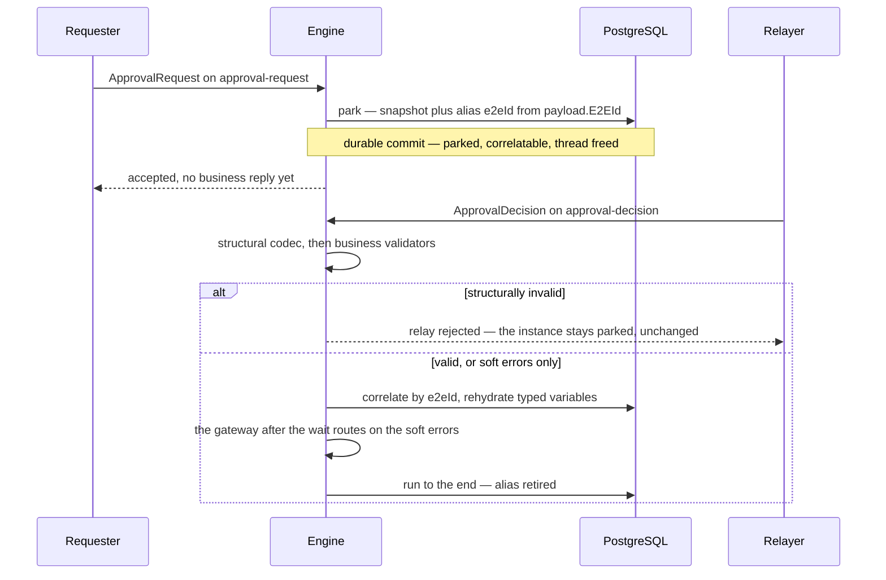

# Wait states and human tasks

Sutra's wait state is an **integration point that waits for an external relay decision** — not a
human-task management system. When a token reaches one, the engine suspends the instance
(persists it, frees the thread); the flow continues only when an external actor — a human via a
console you build, or another system — relays a decision back through a channel as a typed
message. The engine rehydrates and runs to completion.

| Sutra (the engine) provides | You own |
|---|---|
| The wait point + durable suspend / rehydrate / resume | Human-task management: assignment, queues, claim, escalation, SLA |
| A relay channel (typed message in) | Forms and any UI |
| The held instance variables, carried verbatim | Identity / authentication / authorization (who may relay) |
| Compliance-grade audit of the wait and the relayed decision | Notifications, dashboards |

That split is deliberate: full human-task management and forms are a much larger scope than a
workflow engine's core job, and Sutra doesn't try to own them.

## The construct: an intermediate message catch event

The honest BPMN construct is the **intermediate message catch event** — "pause until message *M*
arrives, then continue." A `userTask` is the human-facing flavor of the exact same machinery, for
authors who think in terms of "a human decides here" — it carries no assignee/group/queue model in
the engine; if present, those are just opaque hints in instance variables.

An intake node for a wait declares a channel exactly like a start event's `q:source` — the relayed
message goes through the same two-tier validation pipeline (structural codec, then business
validators) that every inbound message does. The difference is only in what happens after:

| Outcome | Start event (new instance) | Wait state (relay) |
|---|---|---|
| Structurally invalid | No instance minted; error to caller | **Relay rejected; the instance stays parked, unchanged** |
| Soft errors | Minted and run; surfaced as variables | Rehydrated and resumed; the gateway *after* the wait routes on the soft errors |
| Valid | Minted and run | Rehydrated and resumed |

The load-bearing property: **the wait is the safe state.** A hard-invalid relay can never advance
or corrupt a parked instance — it is rejected and the instance sits exactly where it was. The
relayer fixes the message and retries.

## Correlation by a business key you name

```xml
<q:alias name="e2eId" expression="payload.E2EId" unique="true" onConflict="correlate"/>
```

The relayed message doesn't carry an engine-internal instance id — it carries a business value
(an `EndToEndId`, an order reference, whatever your domain already uses), and the process declares a
`q:alias` deriving that key from its own payload. The engine indexes it durably, on PostgreSQL, so
correlation survives a restart and works identically across every replica. See
[The q: namespace](q-namespace.md) for the full `q:alias` shape.



The park is a commit, not a pause: the correlation key is written in the same durable step that
suspends the instance, so a relay arriving later — on a different channel, against a different
replica — finds it by the key you named. And because a hard-invalid relay is refused *before*
anything is rehydrated, the parked instance is never the thing that pays for a bad message.

## Variables survive the wait **typed**

The instance variables held across a wait keep their real types. A number comes back a number, a
boolean a boolean, a list a list, a context a context, a date/time/duration its own temporal type
— and **a null comes back null**, not an empty string.

This matters because FEEL, correctly, does not coerce. A gateway condition after a wait therefore
evaluates against the value's real type:

| After the wait | Evaluates as |
|---|---|
| `amount > 100` where `amount` parked as `1250.75` | a number comparison — `true` |
| `not(approved)` where `approved` parked as `false` | a boolean negation — `true` |
| `cancelledAt = null` where nothing was ever set | `true` |

Two things are deliberately unchanged. First, **the inspect projection is not affected**: every
variable still renders through the display form it always had on `GET /admin/instances/{id}`, so
what an operator's response looks like did not move — typing changed what survives a wait, not
what is shown. (A null now renders as `null` rather than blank, which is the one visible
difference, and it is the correct one.) Second, **the correlation key input is not affected**:
a subject blind-index value keeps hashing the exact string it always hashed.

Two value kinds still persist as their canonical string, because neither is really instance state:
a FEEL **function** closes over an evaluation context that ceases to exist the moment the instance
parks, and a **range** is a comparison shape rather than a value. Both behaved this way before and
still do.

The [design reasoning](../internals/durable-execution.md#the-typed-value-encoding) — the encoding,
the compatibility posture, and why encrypted values are typed too — is in the internals chapter.

## Worked example: approval-hold

`examples/approval-hold` is the reference wait-state flow: a `startEvent` on channel
`approval-request` records the correlation alias (`e2eId = payload.E2EId`, `unique`,
`onConflict="correlate"`), then a `userTask` on channel `approval-decision` — the hold — then an
`endEvent`. Its bundled conformance test drives the full lifecycle against real PostgreSQL:

1. **Park** — an `ApprovalRequest` on `approval-request` returns `200` (accept, no business
   reply yet); the instance parks and its alias is recorded.
2. **Duplicate rejected** — a second `ApprovalRequest` with the same `E2EId` while parked is
   rejected (the durable unique-alias guard).
3. **Relay resume** — an `ApprovalDecision` on the separate `approval-decision` channel — a
   channel no start event subscribes to — is routed by the dispatcher's relay path: the same
   two-tier intake, against the wait node's `q:source`, then correlated by `E2EId`, then resumed.
4. **Retire** — the same `E2EId` is accepted again afterward, proving the alias was retired once
   the instance completed.
5. **Uncorrelated relay is safe** — a decision for an unknown `E2EId` is rejected and every parked
   instance is left untouched.

Try it by hand once the package is deployed (see [Your first deployment](../getting-started/first-deploy.md)):

```bash
# park
curl -sS -X POST localhost:8080/channels/approval-request \
  -H 'Content-Type: application/json' -H 'X-Api-Key: approval-demo-key' \
  -d '{"ApprovalRequest":{"E2EId":"E2E-1","Amount":"1500.00"}}'

# resume it with a decision
curl -sS -X POST localhost:8080/channels/approval-decision \
  -H 'Content-Type: application/json' -H 'X-Api-Key: approval-demo-key' \
  -d '{"ApprovalDecision":{"E2EId":"E2E-1","Decision":"APPROVE"}}'
```

Run the scenario itself with `cd rust && cargo test -p sutra-conformance -- --ignored tc_approval_hold`
(needs Docker — see [Test tiers](../contributing.md)).

## Next

- **[Worked example: money-transfer](worked-example.md)** — the other flagship example, showing
  durable data stores instead of a wait state.
- **[External tasks](external-tasks.md)** — the pull flavour of the same park: a delivery parked
  for a worker to fetch rather than dialed out.
- **[Replica semantics](../architecture/replicas.md)** — how correlation and suspend/resume stay
  correct across a multi-replica engine.
- **[Durable execution](../internals/durable-execution.md)** — what a park actually persists, and
  why it is a snapshot rather than an event log.
