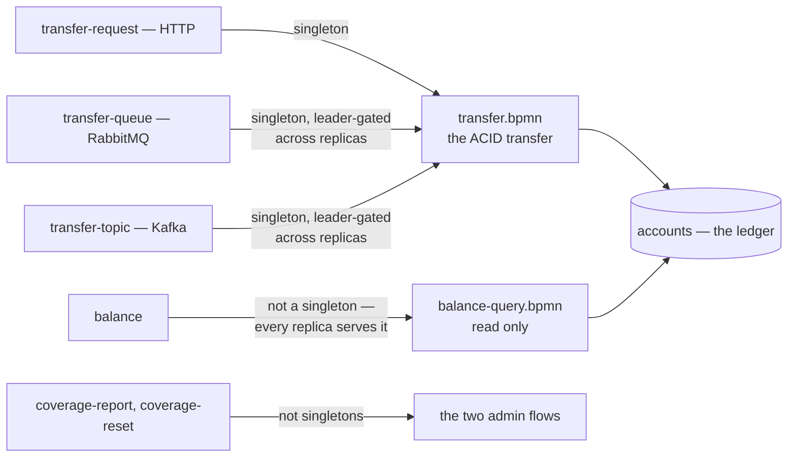
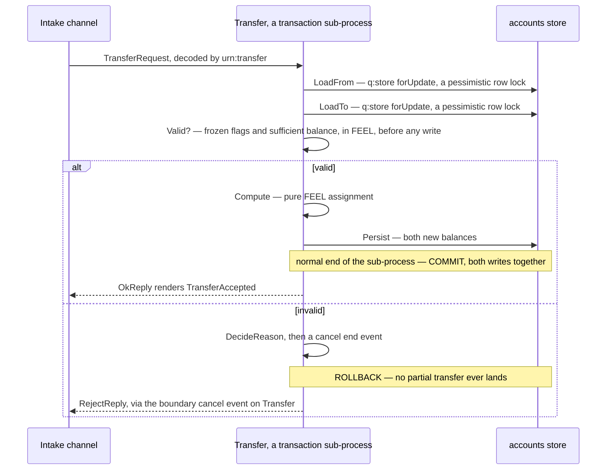

# Worked example: money-transfer

`examples/money-transfer` is the flagship demonstration of full ACID semantics on a **single
writable ledger**, driven from one BPMN process over three different transports (HTTP, RabbitMQ,
Kafka). It exercises most of what the last few chapters covered — deployment packages, channels,
the `q:` namespace, and data stores — in one real flow.

## The shape

```
examples/money-transfer/deployments-src/default--money-transfer--1.0.0/
├── package.yaml                         # labels {tenant: default, module: money-transfer, version: 1.0.0}
├── bpmn/transfer.bpmn                   # the ACID transfer flow
├── bpmn/balance-query.bpmn              # read-only balance lookup
├── bpmn/coverage-report.bpmn            # admin: path-coverage report
├── bpmn/coverage-reset.bpmn             # admin: path-coverage reset
├── channels.yaml                        # 6 channels — 3 intake transports + balance + 2 admin
├── datastores.yaml                      # `accounts` (the ledger) + `coverage` (engine-owned schema)
├── migrations/accounts/V001__accounts.sql
├── schemas/transfer/transfer.xsd        # TransferRequest + BalanceQuery
├── schemas/transfer/codec-manifest.yaml
└── templates/*.hbs                      # reply rendering (accept / reject / balance / coverage)
```

## What it demonstrates

**A module-owned SQL data store.** `datastores.yaml` declares `accounts` — the ledger, one row per
account holding `{balance, frozen}` — with its own connection (`env:ACCOUNTS_DB_URL`/`_USER`/
`_PASSWORD`) and its own idempotent migration under `migrations/accounts/`. See
[Data stores](data-stores.md).

**Per-channel singleton serialization.** Three intake channels — `transfer-request` (HTTP),
`transfer-queue` (RabbitMQ), `transfer-topic` (Kafka) — all drive the *same* `transfer.bpmn`, each
declaring `singleton: true`. On a queue transport that's leader-gated across replicas (a
per-channel PostgreSQL-lease election — see [Replica semantics](../architecture/replicas.md)); on
HTTP the single-writer guarantee instead comes from the `<bpmn:transaction>` scope plus `FOR
UPDATE` row locks in the flow itself. The read-only `balance` channel and the `coverage-*` admin
channels are **not** singletons — they scale across every replica, since they only read or reset
shared state rather than serialize writes to it.



All six channels bind the same `urn:transfer` codec, and the three write intakes converge on one
process rather than three — so the write path is serialized once, by the channel on a broker and by
the transaction plus `FOR UPDATE` locks on HTTP, while the read-only paths stay free to scale.

**A custom module schema.** `schemas/transfer/transfer.xsd` declares `TransferRequest` and
`BalanceQuery` as sibling root elements; the codec registers as `urn:transfer` (see
[Deployment packages](deployment-packages.md) for the path-derived URN rule), and every channel in
`channels.yaml` binds `codec: urn:transfer`.

## The flow, node by node

`transfer.bpmn` has three start events — one per intake channel — that all converge on a single
`<bpmn:transaction>` sub-process named `Transfer`:

```
Start (http) ─┐
StartQueue ────┼──▶ Transfer [transaction]:
StartKafka ───┘        SubStart → LoadFrom → LoadTo → Valid?
                          ├─ ok:      Compute → Persist → SubEnd (normal end → COMMIT)
                          └─ invalid: DecideReason → cancel end event (→ ROLLBACK)
                     → (committed) OkReply (render TransferAccepted) → End
                     → (cancelled, via a boundary cancel event on Transfer) RejectReply → End
```

Full ACID, mapped onto real BPMN + `q:` elements:

- **Atomicity** — `LoadFrom`/`LoadTo`/`Compute`/`Persist` all run inside the `<bpmn:transaction>`;
  a normal end commits both balance writes together, a cancel end (reached from the `Valid?`
  gateway's invalid branch) rolls back — no partial transfer ever lands.
- **Consistency** — the `Valid?` exclusive gateway checks `fromAccount.frozen`,
  `toAccount.frozen`, and `fromAccount.balance < payload.amount` *before* any write, in a visible
  FEEL condition on the sequence flow.
- **Isolation** — `LoadFrom`/`LoadTo` read their rows with `<q:store key="payload.fromId"
  forUpdate="true"/>` — a pessimistic lock serializing concurrent transfers that touch the same
  account — layered under the channel-level singleton/exclusive-consumer contract.
- **Durability** — `Persist` writes both new balances back to the `accounts` store in the same
  transaction; a later instance (on any replica) sees the committed values.

`Compute` and `DecideReason` are pure FEEL data-assignment nodes (`<bpmn:assignment>` pairs of a
`<from>` FEEL expression and a `<to>` target variable) — no service-task implementation code
anywhere in this flow.



The gateway sits between the locks and the writes, so consistency is checked while the rows are
already held — and the only two ways out of the sub-process are the two ends that commit or roll
back, which is what makes the reply and the durable outcome agree.

## Compliance path coverage

```xml
<q:coverage path="accept" flows="Flow_TxToOk Flow_OkToEnd"/>
<q:coverage path="reject" flows="Flow_CancelToReject Flow_RejectToEnd"/>
```

The two business outcomes are declared as tracked routes on the outer process, named for what they
mean (not left as the raw `path-1`/`path-2` `sutra coverage init` would seed) — the curation step
[Coverage: declared routes as the compliance signal](coverage.md) covers in full. A run is
"covered" once its fired-flow trace contains a path's flows, in order, as a subsequence — so any
of the three intake transports covers `accept` when it commits, and covers `reject` when it
cancels. Both marks land in the `coverage` store `datastores.yaml` declares — pointed, for
convenience, at the same database as the `accounts` ledger, and carrying no migration of its own
because the engine owns the coverage schema. The `coverage-report` / `coverage-reset` admin
channels read and clear this compliance metric; see that chapter for the CLI walkthrough
(`init`/`check`/`reset`), the cross-process form a multi-participant collaboration needs instead,
and how to curate a declared set that stays a signal instead of noise.

## Try it

```bash
# seal it
cd rust && cargo build -p sutra-cli --release
target/release/sutra package ../examples/money-transfer/deployments-src/default--money-transfer--1.0.0 \
    --out /tmp/pkgs

# deploy it (see Your first deployment for the full API-deploy walkthrough)
target/release/sutra deploy /tmp/pkgs/default--money-transfer--1.0.0.sutra \
    --api --engine-url http://localhost:<port>

# send a transfer
curl -sS -X POST localhost:<port>/channels/transfer-request \
  -H 'Content-Type: application/json' -H 'X-Api-Key: transfer-demo-key' \
  -d '{"TransferRequest":{"FromAccount":"alice","ToAccount":"bob","Amount":"25.00"}}'
```

Run the full ordered scenario (durability, cross-instance reads, insufficient-funds and
frozen-account rejection, atomicity rollback, isolation under concurrency, then the coverage
report/reset pair) against real PostgreSQL:

```bash
cd rust && cargo test -p sutra-conformance -- --ignored tc_money_transfer_acid_ledger
```

## Next

- **[Architecture](../architecture/overview.md)** — the layering underneath everything this
  example exercises.
- **[Reference: the `sutra` CLI](../reference/cli.md)** — every command used above, in full.
