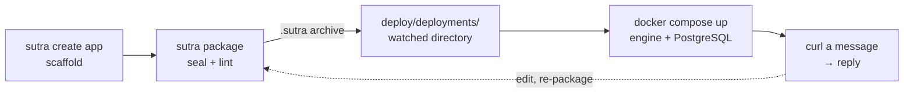

# Quickstart

A running engine and your first message flowing through it. About five minutes, and the only
prerequisites are the [`sutra` CLI](installation.md) and Docker.

What you will have at the end: a BPMN process, bound to an HTTP channel, that decodes and
schema-validates an XML message, branches on the result, and replies — running on the real
engine against a real PostgreSQL, not a simulator.



Five steps, and the last arrow is the loop you stay in: change something, re-package, and the
running engine flips to it.

## 1. Scaffold an app

```bash
sutra create app my-first-app
cd my-first-app
```

That is a complete, deployable application, not a hello-world stub:

```
packages/my-first-app-main/     the deployment package (the unit you ship)
  package.yaml                  identity: tenant, module, version
  channels.yaml                 the HTTP channel the process listens on
  bpmn/sample.bpmn              the process
  schemas/sample/sample.xsd     the message contract
  templates/*.hbs               the reply bodies
deploy/compose.yaml             engine + PostgreSQL
deploy/deployments/             what the engine watches
deploy/smoke.sh                 a health-gated end-to-end check
```

## 2. Package it

```bash
sutra package packages/my-first-app-main --out deploy/deployments
```

`package` seals the directory into a single `.sutra` archive: content-addressed, with a
manifest hash over every entry. It also **lints on the way in** — a template that navigates a
field the schema does not declare, or a channel with no process bound to it, fails here rather
than at 2 a.m. That archive is now the artifact you would promote through environments.

## 3. Start the engine

```bash
docker compose -f deploy/compose.yaml up -d
```

Compose starts the engine image alongside its own PostgreSQL and mounts `deploy/deployments`,
which the engine watches. The archive you just wrote is picked up and activated on boot.

The host port is deliberately dynamic — nothing assumes port 8080 is free on your machine:

```bash
ENGINE=$(docker compose -f deploy/compose.yaml port engine 8080)
curl -s http://$ENGINE/sutra/health/ready
```

```json
{"status":"UP","checks":[{"name":"sutra-loader","status":"UP","data":{"deployments":1,"shards":1}}]}
```

`deployments: 1` is your archive, live.

## 4. Send a message

```bash
curl -s -X POST http://$ENGINE/channels/sample-in \
  -H 'Content-Type: application/xml' \
  -H 'X-Api-Key: dev-only-sample-key' \
  --data '<SampleRequest xmlns="urn:sutra:deployment:my-first-app-main"><note>hello</note></SampleRequest>'
```

```xml
<Accepted xmlns="urn:sutra:deployment:my-first-app-main" process="sample"/>
```

The `X-Api-Key` header is not optional: `channels.yaml` declares `apikey` auth on this
channel, because the engine refuses to wire an unauthenticated HTTP intake
(`SUTRA.CHANNEL.AUTH.MISSING_SCHEME`). The scaffold's dev value is supplied by
`deploy/compose.yaml`; a real deployment resolves `${SAMPLE_API_KEY}` from its secret store.

The **namespace is not decoration** either. The codec validates against
`schemas/sample/sample.xsd`, whose `targetNamespace` is this deployment's
(`urn:sutra:deployment:my-first-app-main`), so an unqualified `<SampleRequest>` is a different
element as far as the validator is concerned and comes back rejected with *no declaration
found*. Payload namespaces are how every message standard this engine speaks — ISO 20022, MT,
NACHA — identifies its documents.

The **reply carries it too**, which is the half people miss. `Accepted` and `Rejected` are
declared in this deployment's own schema alongside the inbound message, so an unqualified
answer would be a different element from the one the schema declares — the same trap, on the
way out — and a caller that validates what it receives could not check it at all. The contract
runs in both directions. See `templates/sample-accepted.hbs`, which says so in a comment.

That reply came out the other end of a real process: the channel decoded the XML, validated it
against `sample.xsd`, started an instance, ran a gateway on the validation outcome, rendered a
template, and replied on the inbound connection. The reply is literally
`templates/sample-accepted.hbs`; edit it to echo a field (`{{payload.note}}`) and the change is
verified against the schema at package time.

Now watch it reject something. Send a payload the schema forbids:

```bash
curl -s -X POST http://$ENGINE/channels/sample-in \
  -H 'Content-Type: application/xml' \
  -H 'X-Api-Key: dev-only-sample-key' \
  --data '<SampleRequest xmlns="urn:sutra:deployment:my-first-app-main"><wrong>hello</wrong></SampleRequest>'
```

```xml
<Rejected xmlns="urn:sutra:deployment:my-first-app-main" process="sample" outcome="FATAL"
          reason="element 'wrong' is not expected at this point of the content model"/>
```

You get the rejection branch, not a stack trace and not a 500. **That is the point of the
whole design**: a schema violation is a routable outcome your diagram models, so the failure
path is as reviewable as the happy path.

The bundled check runs both of those for you:

```bash
./deploy/smoke.sh
```

## 5. Look inside

```bash
# What is deployed, and what state is it in?
curl -s http://$ENGINE/sutra/deployments | jq

# What does the engine think this package binds?
sutra describe packages/my-first-app-main/bpmn/sample.bpmn

# Will a message actually reach a process? (no engine needed)
sutra simulate --channel sample-in --dry-run packages/my-first-app-main/bpmn/sample.bpmn
```

## 6. Change something

Edit `templates/sample-accepted.hbs`, then re-package into the watched directory:

```bash
sutra package packages/my-first-app-main --out deploy/deployments
```

The engine picks up the new archive and **flips atomically**: in-flight instances finish on
the version they started on, new messages land on the new one. No restart, no dropped request.
That is the same mechanism you would use in production — there is no separate "dev mode".

## Clean up

```bash
docker compose -f deploy/compose.yaml down -v
```

## Next

- **[Your first deployment](first-deploy.md)** — deploying over the API instead of a watched
  directory, and what "Active" actually means.
- **[Concepts](../building/concepts.md)** — why the *message*, not a REST call, is the contract.
- **[Channels](../building/channels.md)** — the other eight transports (Kafka, RabbitMQ, SQS,
  Pub/Sub, AMQP, …) your process can listen on without changing the process.
