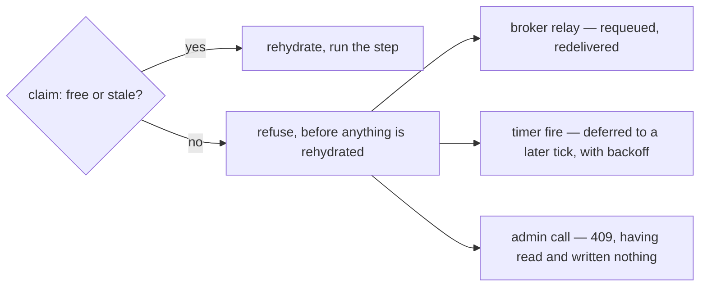
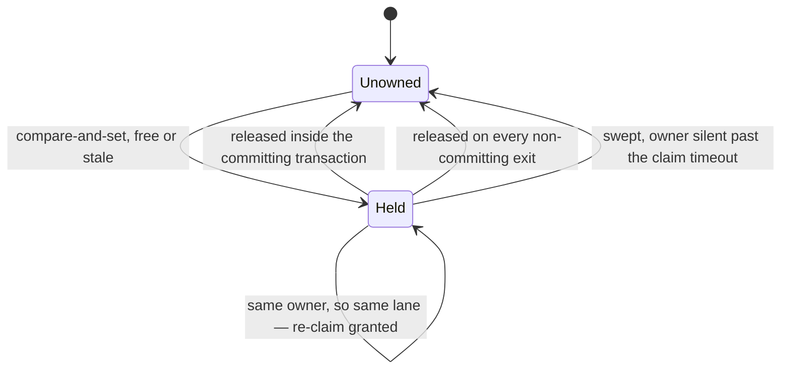

# Ownership and claims

Two things must never happen to one instance: two workers advancing it concurrently, and a worker
holding it forever. The ownership claim is the mechanism for both. The observable behaviour is in
[Replica semantics](../architecture/replicas.md#instance-ownership-claims); this is why it is
shaped the way it is.

## The claim is a compare-and-set, and a failure is a refusal

Every resume path — a correlated relay, a timer fire, an administrative migration — takes the claim
**before** it rehydrates anything, by a conditional update on the instance's own row: take
ownership if it is free or stale, otherwise match nothing.

The critical design choice is what happens when it matches nothing. **It refuses.** It does not
wait, retry in place, or queue behind the holder.

Waiting would be wrong on three counts. It would make the runtime of a request depend on *another
replica's* work, on that work's timescale, with no bound anybody can reason about. It would hold a
transport resource — an in-flight HTTP request, a broker prefetch slot — for the duration. And it
would make a contended path a fundamentally different code path from an uncontended one, which is
exactly the kind of asymmetry that hides bugs until the day of the incident.

Refusing instead composes with mechanisms that already exist. A broker relay is requeued and
redelivered; a timer fire is deferred to a later tick with backoff; an administrative call answers
`409` having **read and written nothing**. The refusal carries a structured code
(`SUTRA.RUNTIME.RESUME.CLAIM_HELD`, or the admin surface's `SUTRA.ADMIN.MIGRATE.CLAIM_HELD`) so a
caller can tell "you lost a race, try again" apart from "this will never work".

The claim comes before any rehydration, so a contended path ends at the diamond rather than partway
through a step — and every branch out of it is a mechanism that already existed, which is why
contention needed no new recovery machinery of its own.

## Release is part of the commit, and part of every other exit

The claim is released **inside the same transaction** that commits the step's writes. "Committed"
and "unowned again" are therefore one atomic fact, and there is no window in which an instance is
durably advanced but still shows an owner — a window a sweeper would eventually have to clean up,
and that a concurrent resume would misread as contention in the meantime.

Every path that does *not* commit has to release too: an early refusal, a validation error, an
unexpected failure, a panic. Originally that was a scope-guard — release on drop, automatically,
whatever the exit. When lane loops became asynchronous, the guard had to change shape, because a
destructor cannot await and releasing is a database call.

So the guard became an **explicit release on every exit**, including the panic path, which is
re-raised identically afterwards. The mechanism moved; the invariant did not. It is worth being
honest that this trades a compiler-enforced guarantee for a reviewed one — the mitigation is that
the exits are few, enumerated, and directly tested, and that the sweep below is the backstop for
the case where the process is not around to run any exit at all.

## Re-entrancy, and the invariant that makes it safe

The compare-and-set deliberately **grants a re-claim to the same owner**. That looks like a hole
until you see the invariant it rests on.

Originally the reasoning was: an owner id names one process, and one process advances instances on
a single execution thread — so the same owner cannot possibly be in two places at once. Re-claiming
what you already hold is a heartbeat refresh, not contention.

Introducing N execution lanes inside one process **invalidated that reasoning exactly**. Under a
per-process owner id, lane B claiming an instance that lane A is mid-step on would succeed
re-entrantly: a silent double-resume, which is precisely the corruption the claim exists to
prevent. All-green tests at one lane would have proved nothing, and the cross-replica tests use
*different* owners, so they could never have caught it.

The fix is to make the owner id lane-scoped, which rotates the invariant into its honest form:

> **same owner ⇒ same lane ⇒ already serialised**

The words changed and the guarantee did not. That is the shape to want from an invariant when the
system underneath it moves.

## Routing is affinity; claims are correctness {#routing-is-affinity-claims-are-correctness}

This is the property the whole lane design leans on, and it is worth stating as its own claim.

Instance-id hash routing exists to give a lane **affinity** for the instances it owns — fewer
cross-lane hops, better cache behaviour, less queue churn. It is not what makes execution correct.

If work for instance X ever lands on the wrong lane — a routing bug, a hash change, a handoff rule
misapplied — the claim bounces it exactly as it bounces a competing replica: `CLAIM_HELD`, requeue
for a relay, defer for a timer fire. **Mis-routing degrades to visible, retry-safe contention. It
can never degrade to interleaved execution.**

That is a much better failure mode than the alternative, where routing *is* the mutual exclusion
and a routing bug is a silent data-corruption bug. It also gives the rollout a direct observable:
the claim-bounce meter, split by relay and timer, should read near zero at a healthy multi-lane
rollout, so a mis-route shows up as a number going up rather than as a support ticket six weeks
later.

## Owner-id suffixes, and why they cannot collide

An owner id is an opaque string to the store and to the sweeper — neither parses it — which is what
lets the conventions layer without a schema change:

| Suffix | Who uses it | Why it is distinct |
|---|---|---|
| Lane index | Every execution lane | So same-owner re-entry means same-lane re-entry (above). |
| A migration marker | The administrative migrate operation | So a migration **cannot** re-enter past a resume this same replica has in flight. |

The migration case is the subtle one, and it is the direct consequence of re-entrancy. Claiming
under the bare replica identity would *succeed* against a resume in flight on that very replica —
the one race the claim exists to prevent, reintroduced by an operator action. Under a distinct
owner the compare-and-set fails honestly, and a resume that starts after the migration claims
bounces off it in turn.

The two conventions cannot collide because they occupy different, non-overlapping parts of the
identity: a lane suffix is a lane index on the execution path, and the migration marker is not a
lane index at all and is never produced by a lane. There is no string a lane can generate that an
administrative claim can also generate.

## Heartbeats: deliberately not wired

A claim could refresh itself mid-step. It doesn't, and that is a decision rather than an omission.

A step runs between quiescent points — milliseconds to low seconds — which is orders of magnitude
inside the default claim timeout. Adding more execution lanes shortens the *queue wait* before a
step; it does not lengthen the step itself. So the mechanism would fire constantly and protect
against nothing.

The condition that would change the answer is a genuinely long-running step. The pull-worker
surface is the shape that could produce one — but it deliberately does not: a task parked for a
worker is *not* a step in progress. The instance parks, its claim is released with the commit, and
the worker's completion re-enters as a fresh delivery later. The long wait lives in a task row's
lock, not in an instance claim, which is exactly why no heartbeat is needed. See [The pull
surface](pull-surface-design.md).

## The sweep is the only backstop that can exist

No release protocol survives a process that stops existing. The stuck-instance sweep is the answer:
a lease-gated role that clears any claim whose owner has been silent longer than the claim timeout.

Three ways out of `Held`, in decreasing order of how much the design leans on them: the commit
itself, the enumerated non-committing exits, and the sweep — which exists only for the process that
is no longer around to run any exit at all.

It sweeps **by age and is owner-blind** — it does not parse owner ids, does not know how many lanes
a replica has, and does not care. That is what let the lane-index suffix land with no change to the
sweep at all: owner cardinality grew, and the sweep predicate never mentioned owners in the first
place.

The tuning trade is plain in the two keys. A short claim timeout recovers faster from a dead
replica and risks stealing an instance from a live-but-slow one — which the claim's own
compare-and-set then makes safe rather than catastrophic, since the original owner's commit no
longer matches. A long one is the conservative direction. The defaults sit far enough above normal
step duration that the first case does not arise in practice.

## Next

- **[Execution lanes: the design](execution-lanes-design.md)** — what the lane-scoped owner is
  protecting.
- **[Migration internals](migration-internals.md)** — the distinct-owner claim in the operation
  that needs it most.
- **[Replica semantics](../architecture/replicas.md)** — the operator-facing view.
