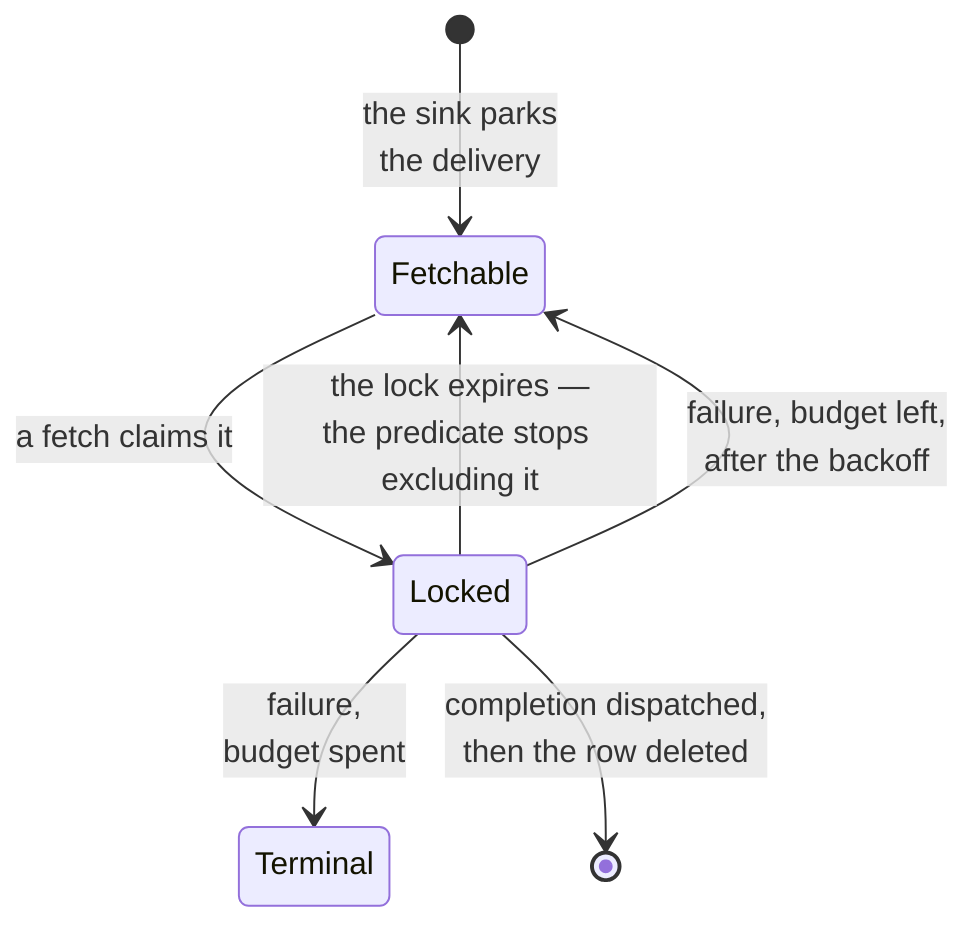
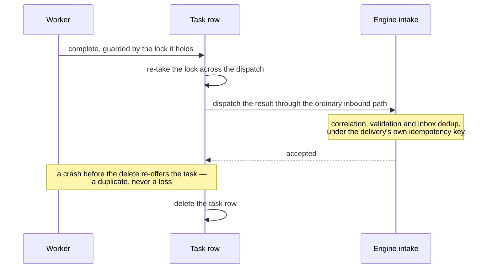

# The pull surface: design

[External tasks](../building/external-tasks.md) is the worker-facing guide. This chapter is why the
pull surface is a hundred lines of new machinery rather than a subsystem — which is almost entirely
down to one decision.

## Ownership transfer is the design

A channel declaring `transport: pull` gets a sink like any other transport. The sink claims its URI
scheme, exactly as an HTTP or broker sink claims theirs. What it does with a delivery is different:
instead of dialing anything, it **parks the delivery as a task row** — and then answers
`Delivered`.

That answer is the whole design. Ownership transfers from the outbox row to the task row, and the
relay deletes the outbox row exactly as it would for a genuinely delivered push.

Everything else falls out of it for free:

- **The relay's retry and poison machinery applies to a failed park automatically.** If parking
  fails — the database is briefly unavailable, say — the sink answers a retryable failure, and the
  outbox's existing backoff curve retries the *park* with no new code. If the operator configured
  an attempt ceiling, an unparkable delivery poisons exactly like an undeliverable one, records its
  incident, and stops pinning a draining deployment. None of that had to be re-implemented for
  pull; it was already there, one layer up.
- **The hot claim predicate is untouched.** The outbox worker's `SKIP LOCKED` batch claim — the
  query that runs constantly on every replica — does not learn about pull at all. It sees a
  delivery, hands it to a sink, and gets an answer. Adding a delivery *mode* without touching the
  hottest query in the system is the payoff for putting the new behaviour behind an existing
  polymorphic seam rather than beside it.
- **Parking is off the execution path.** The sink runs on the outbox tick loop, not on an execution
  lane. It touches the engine actor not at all: a park is a store write plus a wake-up.

The alternative shape — a first-class "pull delivery" concept understood by the dispatcher, the
outbox worker, and the retirement gate — would have been a genuinely new subsystem with its own
retry semantics, its own poison horizon, and its own failure modes to reason about. Modelling pull
as *a sink that happens to hand ownership to a different table* keeps one delivery pipeline.

## The completion is not a new resume path

A worker's result is rebuilt into an ordinary inbound message and re-enters the engine through the
**same seam every transport delivers through**. Not a nested call, not a privileged entry point:
one more serialized turn, indistinguishable from a pushed reply.

That is what keeps three things unchanged rather than duplicated:

- **Correlation.** The parked headers ride through, so the author's `<q:alias>` resolves the waiting
  instance the way it always has.
- **Validation.** The completion goes through the same intake pipeline — a worker cannot smuggle a
  structurally invalid payload past the checks a pushed message faces.
- **Deduplication.** The completion carries the originating delivery's key as an explicit
  idempotency key, so inbox dedup covers it with no worker-side cooperation.

A second resume entry point would have needed all three re-implemented, and would have been the
place where they drifted.

## Lock expiry inside the claim predicate: no sweeper, by construction

A worker that dies mid-task must not hold its task forever. The usual answer is a reaper — a
background job that scans for expired locks and releases them — which is a role to schedule, a lease
to gate, a cadence to tune, and a lag between expiry and availability.

There is none here. **Lock expiry is part of the predicate that decides what a fetch may claim**: a
task is fetchable when it is not terminal, its backoff has elapsed, and it is either unlocked or
holding an *expired* lock. An expired lock is therefore not a state anyone has to clean up. It is
simply not an obstacle to the next fetch.

No edge out of `Locked` is driven by a background job: each one is either a worker's own call or the
claim predicate declining to exclude the row. That is what "no sweeper" actually buys.

The consequences are worth naming, because "no component" is easy to undervalue:

- **No lag.** A task is available the instant its lock expires, not on the next sweep tick.
- **Nothing to gate.** No lease role, no leader, no cadence key, no failure mode where the sweeper
  is down and locks pile up.
- **Nothing to get wrong under concurrency.** The claim and the expiry check are the same statement,
  so there is no window between "the sweeper released it" and "someone claimed it".

The cost of a dead worker is therefore exactly one lock duration — which is a knob the operator
already sets, rather than a second knob about how often to look.

The completion path extends the same idea: it re-takes the lock across the dispatch, so the lock
cannot expire mid-flight and let a second worker pick the task up while the first one's result is
still inside the engine.

## Dispatch, then delete — and why the inverse loses work

The completion order is: verify and hold the lock, dispatch the result through the inbound path,
**then** delete the task row.

That makes the surface **at-least-once**. A crash between the dispatch and the delete re-offers the
task, and a duplicate completion is absorbed by inbox deduplication under the delivery's idempotency
key.

The delete is last on purpose. The crash window between the dispatch and the delete costs a
duplicate that already has a dedup key waiting for it; inverting the two would make that same window
cost the work itself.

The inverse order — delete, then dispatch — would make it **at-most-once**, and the same crash would
lose the work outright: the task is gone, the instance is still parked, and nothing anywhere records
that the worker ever answered. The instance waits forever on a result that was produced and thrown
away.

Between a duplicate the system already knows how to absorb and a silent loss it cannot detect, the
duplicate is not a close call. This is the standard shape of the choice, and it is worth stating in
those terms: **at-least-once plus deduplication beats at-most-once plus hope**, whenever
deduplication is available — and here it is available *by construction*, because the idempotency key
was minted by the delivery that created the task.

A worker that completes with **no result** re-delivers the original request payload. That is the
fire-and-forget shape: the work happened outside, and the flow waits only on the *fact* of it.

If the engine *refuses* the completion on the inbound path, the row stays, still locked until its
grace window elapses, and becomes fetchable again. The refusal carries the engine's own code as an
attribute — not just prose — because that code is the only thing that tells a worker whether
re-fetching later can ever help (a transiently unavailable engine) or never will (a validation
reject that will fail identically forever).

## Zero rows affected is never success

Every worker-facing mutation is **ownership-guarded**: it matches only if this worker still holds
this task's lock. Which means the interesting case is a statement that matches **nothing** — and the
critical rule is that this is never reported as success.

A `200` to a worker whose lock lapsed is a duplicate-execution bug. The worker believes its result
landed; it did not; the task is fetchable again and someone else will do the work too.

So a zero-row result triggers a second, unguarded read to find out *which* situation it is, and the
answer is one of four verdicts:

| Verdict | Situation | What the worker should do |
|---|---|---|
| `LOCK_LOST` | The lock expired or was released; the task is fetchable again | Stop. Do not re-complete — fetch fresh work. |
| `LOCK_HELD` | Another worker holds it | Stop. It is not yours. |
| `TERMINAL` | The budget is spent; it can never be completed or failed again | Stop permanently. |
| `NOT_FOUND` | No such task on any live deployment | Stop; the task is gone. |

Splitting them apart matters because they call for different worker behaviour, and a single generic
"conflict" would leave a worker author guessing — usually by retrying, which is wrong for three of
the four.

The extra read is deliberate and cheap: it happens only on the failure path, and it reads lock state
only. **The payload never rides a failure path** — there is no reason for a task's body to travel
through an error response.

Separating "no such task" from "you do not hold it" needs one more distinction: the guarded statement
is attempted across the live deployment set, and if it matches nowhere, an unguarded existence probe
distinguishes a lock problem from a genuinely absent task. A worker names topics, never deployment
ids — the same posture the outbox worker and the instance listing take — so the surface does the
walking.

## Bounds are rejections, never clamps

Every bound a worker can send — lock duration, long-poll wait, batch size — is a **ceiling the
operator sets**, and an over-ceiling request is a `400`.

Silently clamping would be the friendlier-looking choice and it is the wrong one, for a reason
specific to locks: **a worker that believes it holds a longer lock than it does is a
duplicate-execution bug.** It paces its work against a deadline that already passed, the task goes
fetchable, another worker takes it, and the first one's completion is refused after the work was
already done twice. A clamp does not prevent that; it *creates* the belief that causes it.

The same reasoning applies to the others, less dramatically: a clamped long poll makes a worker's
own timeout arithmetic wrong, and a clamped batch size makes its throughput planning wrong. In each
case the reject is information and the clamp is a lie the system tells quietly.

Omitting a bound is different from asking for too much: an omitted value takes the **default**, not
the ceiling. The default is a considered value; the ceiling is a limit. Conflating them would hand
every silent request the most expensive setting available.

The engine also refuses to boot if the default lock duration exceeds its own ceiling, or is zero — a
configuration that is internally contradictory should fail at startup, where somebody is watching,
rather than at the first fetch.

## The long poll wakes, and cannot miss

A fetch that finds nothing waits, bounded, for a task to be parked on one of its channels. The
wake-up is a broadcast keyed by channel, so a fetch filters to the topics it asked for instead of
re-querying on every unrelated park.

Two properties make it safe:

- **Subscribe before the first query.** A task parked in the window between the query and the wait
  still wakes the waiter. The classic lost-wakeup ordering bug is closed by ordering, not by a
  timeout that hides it.
- **Missing a wake-up is harmless.** A woken fetch always **re-runs the claim query**; the wake-up
  carries no payload beyond "look again". So a lagging subscriber is not an error — it costs at most
  one extra round of a loop it was already in. The ring buffer is deliberately small, because it is
  a doorbell rather than a queue.

And the wait is always bounded by the operator's ceiling, so a fetch answers with an empty list
rather than hanging. A long poll that can hang is a client-side resource leak with extra steps.

## Two budgets that never overlap

The worker-failure budget and a `<q:retry>` policy sit at different layers and never interact:

| | Governs | Counted by | On exhaustion |
|---|---|---|---|
| Worker budget | A worker failing at its own work | The task row | The task turns **terminal** — never fetched again, retained with its last error |
| `<q:retry>` | The task-level outcome in the model | The instance snapshot | The instance fails **durably** |

A worker retrying its own work never touches the instance; the instance stays parked on its wait,
exactly as it would while a worker was simply slow. Conversely a `<q:retry>` timeout on a
pull-backed call still fires if no worker ever completes — the pull surface changed the last hop,
not the model's semantics.

A terminal task no longer counts toward its deployment's retirement quiescence gate, for the same
reason a poisoned delivery doesn't: "we gave up" must be a durable, visible state, and it must not
hold a deployment open forever. That symmetry is intentional — the terminal task **is** the
pull-side twin of the outbox's poison horizon. See [Retry machinery](retry-machinery.md).

## Posture

These are operate-surface routes, not administrative ones, and the classification is a judgement
worth stating: **a completion is an ordinary delivery**, not a privileged control operation. It goes
through the same intake as a pushed reply, and it can do nothing an inbound message on that channel
could not do.

So it carries the operate surface's cluster-internal posture rather than the administrative
surface's gate. A deployment needing authenticated workers puts them behind the same ingress policy
the rest of the operate surface already needs.

## Next

- **[External tasks](../building/external-tasks.md)** — the worker-facing guide.
- **[Retry machinery](retry-machinery.md)** — the other budget, and the outbox poison horizon this
  mirrors.
- **[Ownership and claims](ownership-and-claims.md)** — why a task lock is not an instance claim.
