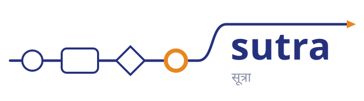
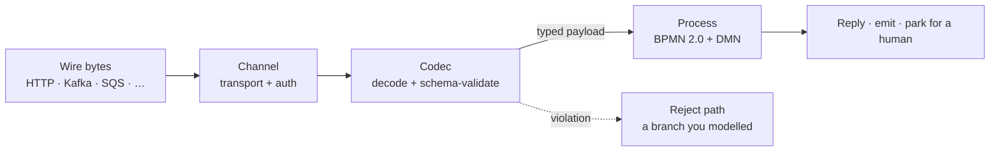

# Introduction

<picture>
  <source media="(prefers-color-scheme: dark)" srcset="images/brand/sutra-lockup-dark.svg">
  
</picture>

**Sutra is a Rust-native, message-native workflow engine built on BPMN 2.0.** It turns a
standard BPMN process into a declarative way to **consume typed, schema-validated messages off
any channel**, route and correlate them, **pause for human decisions**, and reply — as a single
statically-compiled binary (no JVM, no GC) that is multi-tenant, content-addressed, and
hot-deployable.

Most workflow engines treat the payload as an opaque blob and start a process with a REST call.
Sutra makes the **message a first-class, typed contract**: a start event binds to a *channel*
(HTTP or a broker) and a *message type*; the engine **decodes the real wire format, validates it
against its schema on the way in**, and drives the process with the typed payload, surfacing
violations as *routable soft errors* rather than exceptions. The engine itself ships the
schema-less structural formats (JSON, XML, YAML, CSV, raw text and bytes); a *typed* contract
comes either from the deployment package — drop your XSDs into it and the engine compiles them
when the package deploys — or from an extension crate implementing the codec SPI, which is how
a message standard (an industry wire format with its own envelope grammar and schema editions)
is served.

Validation sits *in the doorway*, not inside your process — which is why a schema violation is
a branch you drew rather than an exception you catch.

The engine core is **domain-neutral**: no business vertical lives in the engine itself — it
lives entirely in codecs, channels, and modules. It also collects **no telemetry of its own** —
no usage statistics, no crash reports, nothing phones home, ever; the only data a running engine
ever sends anywhere is what you explicitly configure it to export (see
[No telemetry, no phone-home](architecture/observability.md#no-telemetry-no-phone-home)) — worth
stating plainly for an engine meant to carry sensitive, typed messages.

## Why Sutra exists

Nearly every production-grade BPMN 2.0 engine is JVM-based; the production-grade native-language
orchestrators (Temporal, Cadence, Argo) deliberately *aren't* BPMN. Sutra is built for that gap
— a native-compiled, standards-oriented BPMN engine that treats the message as the contract.

## What Sutra ships

Sutra is four things, and this book covers all of them:

1. **The engine** — a container image built from the `sutra-dist` composition root
   (`docker build -f rust/Dockerfile rust/`), the thing you actually run. It force-links the
   built-in formats, transports, redactors, and secret resolvers into one deployable binary.
2. **The `sutra` CLI** — one binary (`rust/crates/sutra-cli`) that scaffolds, validates,
   packages, deploys, and inspects deployments. See [Getting started](getting-started/installation.md)
   and the [CLI reference](reference/cli.md).
3. **Two standalone library crates** — [`sutra-feel`](reference/crates.md) (the FEEL
   expression language) and [`sutra-dmn`](reference/crates.md) (the DMN 1.5 decision-table
   core). Both compile and run independently of the engine — embed FEEL or DMN evaluation in
   your own Rust project without pulling in BPMN, channels, or persistence.
4. **This book** — Getting Started, Building BPMN Solutions, Architecture, Operating,
   Reference, and Contributing.

## Honest capability summary

- **BPMN 2.0 coverage.** Start/end/intermediate events, all four gateway kinds, embedded /
  transaction / ad-hoc / event sub-processes, service/script/business-rule/user tasks, data
  objects and data stores, link/escalation/error events, compensation, and path-coverage
  instrumentation for compliance reporting — see
  [Coverage: declared routes as the compliance signal](building/coverage.md).
- **DMN + FEEL conformance — measured, not asserted.** Sutra's DMN/FEEL evaluator is checked
  against the real OMG DMN Technical Compatibility Kit. Current standing: **compliance level 2,
  100% (126/126)**; **compliance level 3, 99.4% absolute (3349/3369)**, with 100% of attempted
  cases passing (0 semantic failures — the remaining gap is a small, enumerated set of
  out-of-scope external-function-execution cases). See
  [DMN-TCK conformance](reference/dmn-tck.md) for what that means and what is deliberately out
  of scope.
- **Channels and transports.** HTTP, five brokers (Kafka, RabbitMQ, AWS SQS, Google Pub/Sub,
  AMQP 1.0), and an air-gapped file transport, all behind one neutral transport SPI — see
  [Channels and transports](building/channels.md).
- **Typed codecs — the machinery, not a catalog of standards.** Decode and schema-validation are
  one step, and what a codec yields is a `messageType`, a walkable payload, and a *shape* every
  FEEL path in the process is checked against at load time. Six formats are built in (JSON, XML,
  YAML, CSV, raw text, raw bytes). A schema-bound codec comes from one of two places: the
  deployment package itself — XSDs under `schemas/<name>/`, compiled at deploy time, no Rust and
  no engine build — or an extension crate against the public codec SPI, which is what a message
  standard (an industry wire format with its own envelope grammar, wrapper profiles, and schema
  editions) needs and what a downstream distribution force-links for itself. The engine ships no
  domain codec of its own; see
  [Domain neutrality and the SPI model](architecture/neutrality-and-spi.md).
- **Stateful execution.** Wait states (`userTask`, intermediate message catch) suspend, persist,
  and rehydrate on PostgreSQL, correlated by a business key you name — see
  [Wait states and human tasks](building/wait-states.md). State shared *across* instances lives in
  a [data store](building/data-stores.md), which is key/value by default — one row per key, holding
  a value of any shape — and which can additionally project a *flat* record onto real typed
  columns, so the SQL tooling you already point at that database reads it directly.
- **What's still thin.** There is no operations console — the admin HTTP API is complete, but
  a UI over it is roadmap, not shipped. Worker helper libraries beyond the HTTP pull API are
  ecosystem work that hasn't happened yet, and macOS has no published CLI binary (it builds
  from source). Where a chapter below is a stub, it says so explicitly rather than padding.

## Where to go next

- **[Installation](getting-started/installation.md)** — one line for the CLI, one pull for the engine.
- **[Quickstart](getting-started/quickstart.md)** — scaffold an app and watch a typed
  message flow through: decode → validate → route → reply.
- **[Concepts](building/concepts.md)** — the ideas that make Sutra different: typed message
  contracts, channels, wait-states, the `q:` vocabulary, and content-addressed deployment.

> This book is a work in progress. Chapters are being filled in as the 1.0 release approaches.
