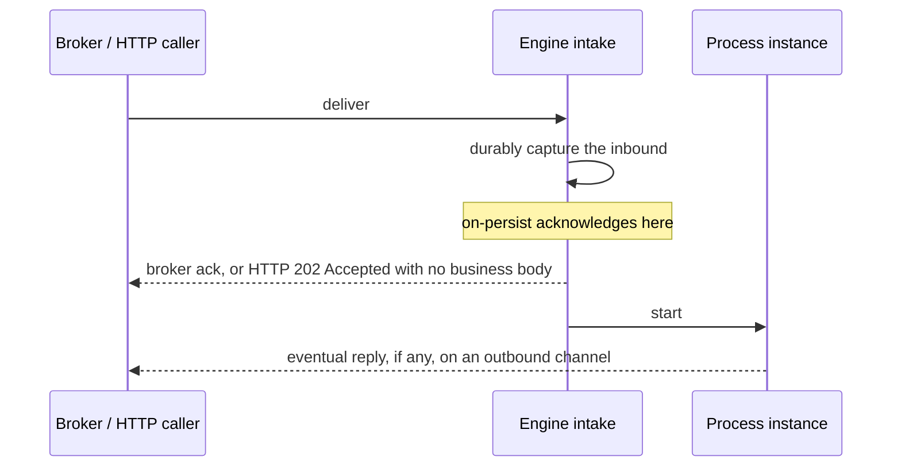
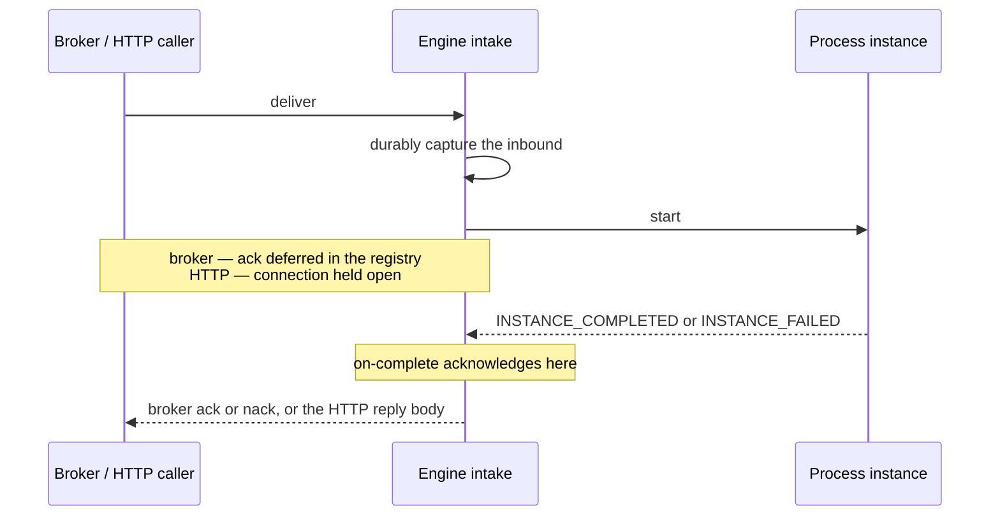
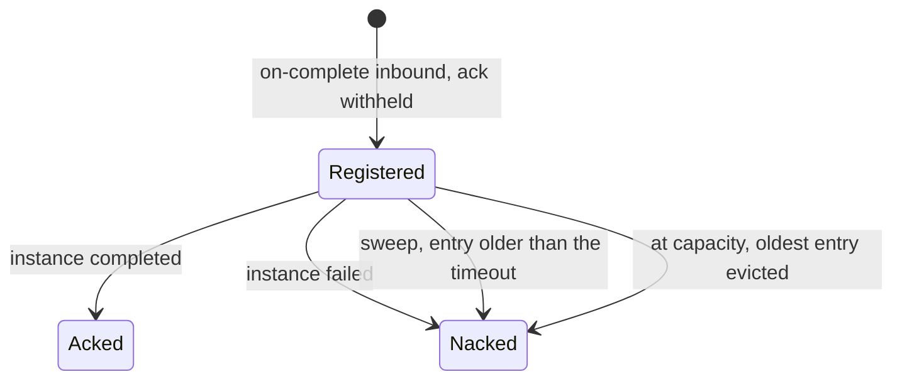

# Acknowledgement modes

An inbound channel declares an `ack-mode` that decides **when** the engine acknowledges receipt
relative to processing. How each transport actually realizes that intent differs — a broker gets a
native ack/nack, HTTP gets a status code — but the two values mean the same thing everywhere.

## The two modes

- **`on-persist`** — acknowledge the moment the engine has durably captured the inbound, *before*
  the BPMN process runs. On a broker: ack immediately, releasing the delivery slot early (lower
  broker-side latency; a redelivery after a mid-process crash is caught by inbox dedup). On HTTP:
  reply `202 Accepted` with no business body and process asynchronously — the fire-and-forget
  intake, whose eventual reply (if any) rides an outbound channel instead of the original
  connection.
- **`on-complete`** — acknowledge only once the instance reaches a terminal state
  (`INSTANCE_COMPLETED` or `INSTANCE_FAILED`). On a broker: the ack is *deferred* — registered
  against the engine's `DeferredAckRegistry` and held until the instance finishes. On HTTP: hold
  the connection open until completion and return the reply body — the classic synchronous
  request/reply.





The two are identical up to the durable capture; the mode moves only where the ack arrow sits. That
one move is the whole trade — release the delivery slot early and let inbox dedup absorb a
redelivery, or hold it so the broker's own redelivery is your crash-recovery path.

**The default differs by transport, because the natural mode differs**: broker channels default
to `on-persist` (release the delivery slot early); HTTP channels default to `on-complete`
(synchronous request/reply). An HTTP channel opts into asynchronous intake by declaring
`ack-mode: on-persist` explicitly.

```yaml
channels:
  - name: orders-inbound
    transport: http
    bind: "POST /channels/orders-inbound"
    ack-mode: on-persist     # HTTP: 202 Accepted, no synchronous reply body
```

## When to pick which

| Use `on-persist` when… | Use `on-complete` when… |
|---|---|
| The process is short-lived | The process takes real time (minutes, not milliseconds) |
| You want the broker slot released fast | You want the broker to redeliver if the engine crashes mid-process |
| Downstream tolerates at-least-once with inbox dedup catching the duplicate | The side effect is non-idempotent and you want broker redelivery as the restart-recovery path |
| You don't want a bounded in-memory registry on the engine | You can afford the deferred-ack registry's configured capacity of pending entries |

The mode is set **per channel** — different channels on the same engine can use different modes.

## Per-transport wiring — what actually realizes `on-complete`

`on-complete`'s deferred-settle mechanism is a capability each transport factory self-declares
(see [Domain neutrality and the SPI model](../architecture/neutrality-and-spi.md)) — the engine
never hardcodes a per-vendor branch. Current wiring:

| Transport | `on-complete` | Mechanism |
|---|---|---|
| RabbitMQ | wired | Deferred settle via the registry: `basic.ack` on completion, `basic.nack(requeue=false)` on failure/timeout/overflow. |
| Kafka | wired | Settle commands over an internal channel to the consumer task; per-partition low-watermark commits, so an out-of-order settle can never mask an earlier nack. |
| AWS SQS | wired | Ack = `delete_message`. The visibility timeout keeps running while parked — size it (and the registry timeout) against expected instance duration. |
| Google Pub/Sub | wired | Per-message `ack()`/`nack()` handles held in the callback; same lease-timeout caveat as SQS. |
| AMQP 1.0 | wired | Dispositions bridged to the session task (accept / reject). |
| File | wired | The terminal file move (`.done/` / `.failed/`) happens at the instance's terminal event. |
| HTTP | native | Connection-hold *is* its `on-complete` — no registry involved. |
| Knative | wired (response-hold) | The push response is held to the terminal event, bounded by a hold timeout; expiry degrades to a loud warning rather than losing the signal. |
| Dapr | not supported | Dapr's own pub/sub components own redelivery timers; holding the push response would multiply duplicate deliveries rather than strengthen the guarantee. Declaring `on-complete` here boots with a loud diagnostic and runs `on-persist` instead. |

A channel declaring `ack-mode: on-complete` on a transport whose factory reports it can't realize
it never fails silently — the engine emits `SUTRA.ACK.ON_COMPLETE_UNSUPPORTED` at startup and
runs `on-persist`.

## The deferred-ack registry

The registry (`sutra-channels`) is a bounded, insertion-ordered structure with three operator
knobs (see [Configuration reference](configuration.md)):

| Key | Default | Behavior |
|---|---|---|
| `sutra.ack.deferred.capacity` | 10 000 | At capacity, `register()` nacks the oldest entry (`SUTRA.ACK.DEFERRED_OVERFLOW`) before accepting the new one. |
| `sutra.ack.deferred.timeout` | 1 hour | The sweep nacks any entry older than this (`SUTRA.ACK.DEFERRED_TIMEOUT`) — the broker slot frees, but the instance itself keeps running; inbox dedup absorbs any resulting redelivery. |
| `sutra.ack.deferred.sweep-interval` | 1 minute | Cadence of the background sweep task. |

Eviction is an **operator-visible failure mode**, not a silent memory leak — repeated
`SUTRA.ACK.DEFERRED_OVERFLOW` events mean either raise the capacity or find the runaway processes
that aren't reaching a terminal state. Diagnostic codes at each stage:
`SUTRA.ACK.DEFERRED_REGISTERED` (debug), `SUTRA.ACK.DEFERRED_ACKED` (debug),
`SUTRA.ACK.DEFERRED_NACKED` (info — a permanent reject), `SUTRA.ACK.DEFERRED_OVERFLOW` (warn),
`SUTRA.ACK.DEFERRED_TIMEOUT` (warn), `SUTRA.ACK.ON_COMPLETE_UNSUPPORTED` (warn, at startup).



The completion and failure edges are the mode working as intended. The sweep and capacity edges are
the ones an operator watches: a timeout nack frees the broker slot while the instance keeps running,
and repeated overflow means either the capacity is too low or something is never reaching a terminal
state.

## Migration note

Omitting `ack-mode` entirely preserves today's behavior exactly: a broker channel stays
`on-persist`, and an HTTP channel stays synchronous (`on-complete`). Turning on a broker's
deferred ack, or an HTTP channel's async intake, is a one-line addition to `channels.yaml` and
takes effect on the next deployment poll.

## Next

- **[The money-transfer worked example](../building/worked-example.md)** uses `singleton` +
  `ack-mode` together across three transports feeding one process.
- **[Troubleshooting BPMN solutions](troubleshooting.md)** — reading the `SUTRA.ACK.*` codes above
  out of the audit trail when a message seems to have vanished.
