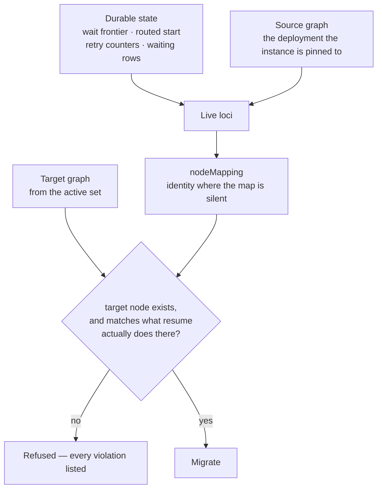
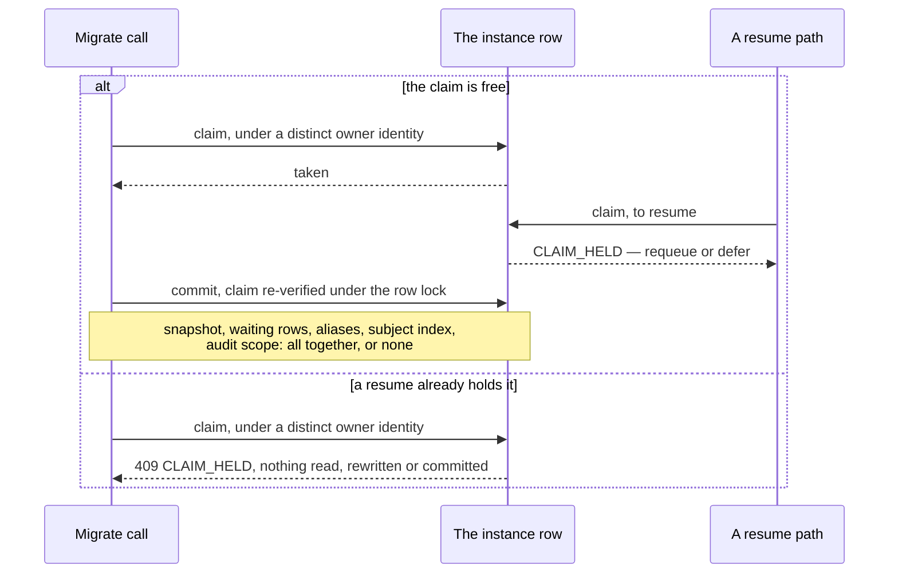

# Instance migration

An instance is pinned to a **deployment** — by content hash — the moment it first parks, and every
resume path resolves that pin fail-closed. That is what stops accidental version skew: a
hot-deploy leaves the previous graph draining precisely so pinned instances keep resuming on the
definition they started under, and a lost pin refuses rather than guesses.

It has one consequence with no escape hatch. **An instance parked on a broken model stays parked
on the broken model** until somebody cancels it. Migration is the sanctioned way off the pin.

It is deliberately *not* a versioning mechanism. There is no in-process branch to author and no
fleet of workers to label. There is one operator action, with a machine-readable report, that can
be dry-run before it is done, refused with every violation listed rather than the first, and read
back out of the audit journal afterwards.

## The two endpoints

| | |
|---|---|
| `POST /admin/instances/{id}/migrate` | One instance. |
| `POST /admin/instances/migrate` | A filtered population off one source pin. |

Both are on the gated admin surface (see [Configuration
reference](configuration.md#admin-api-auth)), and both take the same shape of request: a target
deployment, an optional node mapping, and the `dryRun` / `resume` / `targetProcessId` switches.

```bash
curl -sS -X POST "$ENGINE/admin/instances/$ID/migrate" \
  -H "Authorization: Bearer $TOKEN" -H 'Content-Type: application/json' \
  -d '{ "targetDeploymentId": "dep-9f3c…",
        "nodeMapping": { "Approve": "ApproveV2" },
        "dryRun": true }'
```

## Validation is the substance

The engine loads **both** graphs — the source from the deployment the instance is pinned to, the
target from the active set — and derives every **live locus** from durable state: the snapshot's
wait frontier, its routed start event, its retry attempt counters, and the instance's waiting
rows.

Each locus is mapped through `nodeMapping` (identity where the map is silent), and the target node
must exist *and* be compatible with **what resume actually does there**. That last phrase is the
whole idea. Compatibility is not a BPMN type check; it is a check against the resume behaviour the
locus will get:

| Locus | The target node must be | Because resume… |
|---|---|---|
| `MESSAGE_WAIT` | relay-resumable — a `userTask`, an intermediate message catch, or a channel-call `serviceTask` | correlates an inbound, marks the node satisfied, and continues from its outgoing edges |
| `TIMER_WAIT` | timer-capable — a timer catch event, a timer boundary, or a `<q:timeout>`-synthesized boundary | routes a due fire through the timer node's own semantics |
| `RETRY_PARK` | a `serviceTask` carrying `<q:retry>` | **re-runs the task** rather than treating the node as done — so merely timer-capable is not enough |
| `CONTINUE_REPLY_PARK` | a node carrying `<q:reply continue="true">` | takes the relay path, not the timer path, and re-drives the parked tail |
| `ROUTED_START` | a start event | replays multi-start routing from it |
| `RETRY_BUDGET` | a node carrying `<q:retry>` | a burned attempt budget landing on a policy-less node would silently apply attempts nobody declared |

**Every violation is reported, not just the first.** Fixing a mapping should take one round trip,
not one per node.



Both graphs are loaded, so the check runs against the target's real nodes rather than against the
mapping's good intentions — and a refusal comes back complete, not one node at a time.

Some findings are warnings rather than refusals:

- **A completed node the target does not declare** — not a live locus, so not fatal. But
  replay-as-done matches by id, so if the target still *reaches* that node it will be executed
  again. Dropping a node is legitimate model evolution, so this is loud rather than blocking.
- **A frontier entry with no waiting row behind it** — validated as a message wait and migrated
  anyway; the frontier is the resume-side truth and is never dropped.
- **Pending outbox rows on the source** — see [What moves](#what-moves-and-what-deliberately-does-not).

### Dry run

`dryRun: true` mutates nothing: it takes no ownership claim and writes no row, and returns the
same full report. Because nothing was locked while it was produced, a dry-run report is
**advisory** — a concurrent resume can move the frontier out from under it. The report says so.

### Node mapping is checked, not merely applied

A mapping entry naming a node the instance neither parks at nor has completed is **refused**
(`MAPPING_INVALID`), not ignored. A typo must never read as "identity mapping, then".

## Lifecycle rules

- **The target must be active.** A draining target is refused: a draining deployment retires the
  moment it is quiescent, so migrating onto one strands the instance again and costs a migration
  to do it. Unknown ids are the same refusal.
- **The source graph must still be registered** (active or draining). Quiescence gating means a
  live instance always keeps its deployment registered, so this only bites after a forced
  retirement — and it is a hard refusal rather than a fallback, because validating a
  continue-reply park against the wrong rule would pass the wrong check.
- **Terminal instances are a validation error.** Completed and terminated instances are retained
  history, and re-pinning history rewrites the record of where it ran.
- **`FAILED` instances *are* migratable** — and that is the prime use case.
- **A no-op is refused** (`TARGET_SAME_AS_SOURCE`) rather than silently rewriting a row for
  nothing.

## Migration never auto-resumes — unless you ask

Migration re-pins and rewrites. Full stop. A `FAILED` instance stays `FAILED` under the new pin,
and bringing it back is a separate, explicit decision — `resumed: false` is in every response so
no caller has to infer it.

`resume: true` is that decision, and it closes the repair loop the operation exists for: **fix the
model, migrate the dead instance onto it, bring it back.** On a successfully migrated `FAILED`
instance it clears the failure state, re-stamps the snapshot suspended, and re-arms the parks the
failure commit tore down — all inside the migration's **own transaction**, so a crash can never
leave a half-revived instance.

It then comes back through the **ordinary** paths: a re-armed timer whose due instant has passed
is claimed by the timer poller on its next tick; a message park waits for its next correlated
inbound exactly as it would have. There is no privileged re-drive, which is exactly why the
claim-guarded concurrency story below still holds afterwards. A burned `<q:retry>` budget stays
burned — resume is not a retry reset.

On an instance that is **not** `FAILED`, `resume: true` is a validation error
(`RESUME_NOT_FAILED`), not a no-op. A suspended instance is not stuck; it is parked, and it
resumes on its own correlation or its own timer with no operator action at all. Reporting
`resumed: false` for it would let a caller believe they had woken something.

## What moves, and what deliberately does not {#what-moves-and-what-deliberately-does-not}

| | Moves? | Why |
|---|---|---|
| The instance snapshot | Yes — re-pinned, node ids rewritten | It *is* the instance. |
| Waiting rows | Yes — node ids mapped; kind, due instant and timestamps intact | A park with an hour left still has an hour left. |
| Correlation aliases | Yes, verbatim | **Must**: relay correlation resolves the instance through them. Leaving them behind makes a migrated instance unreachable. |
| Subject index rows | Yes, verbatim | **Must**: erasure and disclosure find instances through them. Leaving them behind makes a migrated instance un-erasable. |
| Audit journal | Yes — scope only; **node ids left verbatim** | A trail names where something happened, under the graph that was live then. Rewriting the ids would falsify it; a `SUTRA.INSTANCE_MIGRATED` event records from→to, so the provenance is recoverable. |
| Pending outbox rows | **No** | An emission was minted by the source deployment's channel bindings and is dispatched against them — and the dispatcher covers draining deployments, so it drains where it was made. Re-targeting a message at bindings that never produced it would be worse than leaving it. Reported as a warning. |

Coverage cursors travel verbatim, because they are keyed by *declared path id* rather than by node
id — the node mapping must not touch them.

Encrypted variables ride through as ciphertext and still decrypt under the new pin. That is by
construction rather than by luck: the authenticated-data binding for an at-rest value deliberately
excludes the deployment id, precisely so that "a migration changes only the pin" stays true.

## Concurrency: the claim, and why it bounces

A real run **claims the instance first**, through the same per-instance ownership machinery every
resume path uses (see [Replica
semantics](../architecture/replicas.md#instance-ownership-claims)) — and under a *distinct* owner
identity, so a migration can never slip past a resume this same replica has in flight. The claim is
re-verified under the row lock inside the commit itself, closing the gap between "claimed" and
"moved".

Contention is a retry-safe `409` (`SUTRA.ADMIN.MIGRATE.CLAIM_HELD`) with **nothing read, rewritten
or committed**. A resume that starts after the migration claims bounces off it in turn.

The move itself is **one transaction**: snapshot, waiting rows, aliases, subject index and audit
scope all land under the new pin together, or none do. No session ever observes the instance under
both pins or under neither.



Whichever side gets there first, the other one bounces retry-safely — the distinct owner identity is
what stops a migration re-entering past a resume already in flight on the same replica.

## Batch migration

`POST /admin/instances/migrate` applies the same validation, the same compatibility matrix and the
same node mapping to a filtered population.

**Selection.** `filter.sourceDeploymentId` is **required** — one migration names one source graph
and one target graph, and a node mapping that is correct for one source is meaningless for
another. There is deliberately no "every deployment" mode. Optional narrowing: `processId`,
`status` (`SUSPENDED` or `FAILED` — the only two an instance can migrate in), `includeTerminal`,
and `limit` (default 100, clamped to 1000).

Selection is ordered by **instance id**, then limited. Ordering by a timestamp that moves under a
live population is exactly how a caller silently skips work.

Retained terminal rows are excluded unless `includeTerminal` asks for them — a busy deployment
holds a whole retention window of finished instances, and a report where they crowd out the live
ones is worse than useless. The flag exists so a caller who wants to know *why* an instance was not
moved gets an explicit `INSTANCE_TERMINAL` refusal instead of a silent omission.

**Every instance is its own transaction.** One claim, one commit, one report entry. There is
deliberately no batch-wide transaction — which is the point, and which makes the crash story
trivial: a mid-batch crash leaves every instance either fully migrated or completely untouched,
because that is already true of each instance's own commit and there is nothing larger to be half
applied. Nothing about one instance can decide another's fate.

**Per-instance outcome** is a single enum, so no caller has to infer one from a combination of
booleans:

| Outcome | Meaning |
|---|---|
| `MIGRATED` | Moved. |
| `VALID` | A dry run validated it. |
| `REFUSED` | Validation said no; the report says why. |
| `BOUNCED` | Its ownership claim was held. Nothing read or written — **re-run to pick it up**. |
| `NOT_FOUND` | Selected, then gone. |
| `ERROR` | Something else failed for this instance alone. |

**The HTTP status describes the batch, not its instances.** A run in which every instance refused
still answers `200`: the call was accepted, executed to completion, and reported in full — which
is exactly what was asked. `400` is a malformed request, `422` a batch-level refusal (target not
active; source and target the same pin), `503` no persistence. **Scripts key on `totals` and on
each entry's `outcome`, never on the status line.**

**Contention is reported, never retried.** Retrying inside the call would make an admin request's
runtime unbounded — the claim is held by another replica's work, on that work's timescale, not
yours — and would turn the report into a claim about a moment that has already passed. Re-run the
same request instead: the selector is deterministic and whatever moved is no longer under the
source pin, so a re-run converges.

Two contradictions are caught from the request alone rather than N times over in the per-instance
reports: `resume` with `status: SUSPENDED` (it selects exactly the instances resume refuses), and
`targetProcessId` without `processId` (re-homing a mixed population into one process is never what
anyone means, and one mapping could only be right for one of them).

## Cross-process re-homing

`targetProcessId` re-homes the instance into a **different process** of the target deployment.
Naming the instance's own process id is not a cross-process migration — being explicit must never
change semantics.

**Identity is never implicit across a process boundary.** Every live locus must carry an explicit
`nodeMapping` entry, or the migration is refused with `CROSS_PROCESS_UNMAPPED` — a *different* code
from the ordinary unmapped-node refusal, because the danger is the opposite one: the id probably
*does* exist in the target. Two processes that both declare `Approve` are not thereby the same
`Approve`, and an accidental collision between unrelated graphs must never read as a deliberate
mapping.

Everything else is unchanged. The same compatibility matrix is evaluated against the target
*process's* graph; a target deployment that does not declare the named process is `PROCESS_ABSENT`,
and its message names both the process asked for and the ones actually there. The snapshot's
process id and the waiting rows' process id are rewritten together, because the timer poller
reports it and the admin listing renders it — a row still naming the source process would describe
the instance as living somewhere it no longer does.

One honest wrinkle: a cross-process move can carry a coverage cursor for a path the target process
does not declare. It is inert, and remapping it would need a path mapping nobody supplied.

## Status codes and diagnostics

| Status | Meaning |
|---|---|
| `200` | Migrated, or dry-run validated. The body is the full report. |
| `400` | The id is not a UUID, or the body is malformed / missing the target. |
| `404` | No such instance. |
| `409` | Retry-safe refusal: claim held, a unique-live alias collides under the target, or the validated move did not commit. Nothing moved. |
| `422` | Validation failed. The report lists **every** violation. |
| `503` | No persistence configured. |

All codes are under `SUTRA.ADMIN.MIGRATE.` — `TARGET_NOT_ACTIVE`, `TARGET_SAME_AS_SOURCE`,
`SOURCE_UNRESOLVABLE`, `PROCESS_ABSENT`, `NODE_UNMAPPED`, `NODE_INCOMPATIBLE`, `MAPPING_INVALID`,
`INSTANCE_TERMINAL`, `CROSS_PROCESS_UNMAPPED`, `RESUME_NOT_FAILED`, `CLAIM_HELD`,
`ALIAS_CONFLICT`, `COMMIT_FAILED` — plus the warnings named above. `CLAIM_HELD` is the admin twin
of the resume paths' own, and carries the same retry-safe posture.

## A worked repair loop

1. An instance fails. It is `FAILED`, retained, and blocking its deployment's retirement.
2. Fix the model; package and deploy it. The new deployment becomes active; the old one drains.
3. **Dry-run** the migration against the new deployment id. Read the report; supply
   `nodeMapping` entries for anything renamed until it validates clean.
4. Run it for real with `resume: true`.
5. The instance comes back through the ordinary timer/correlation paths. Once it and its siblings
   finish, the old deployment goes quiescent and retires on its own.

For a population, do steps 3–4 with the batch endpoint and a `filter.sourceDeploymentId` of the
old pin, then re-run until `totals` shows no `BOUNCED`.

## Next

- **[Deploy, hot-deploy, and rollback](deploy-rollback.md)** — how the pin and the draining tail
  arise in the first place.
- **[Replica semantics](../architecture/replicas.md)** — ownership claims and durable `FAILED`.
- **[Retries, history, and schedules](../building/retries-history-schedules.md)** — the most
  common way an instance gets to `FAILED` in the first place.
- **[Migration internals: the design reasoning](../internals/migration-internals.md)** — the
  two-scope commit, locus derivation, and the re-arm set.
